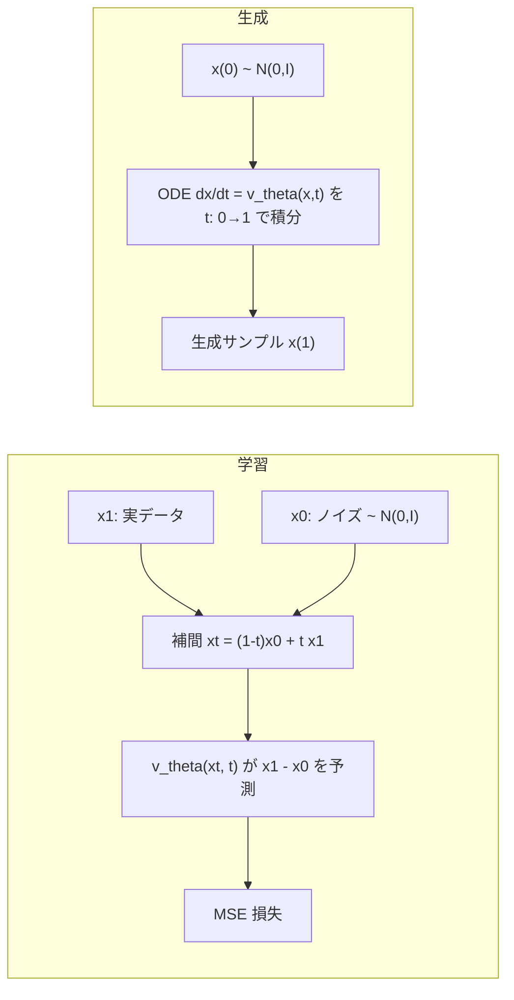
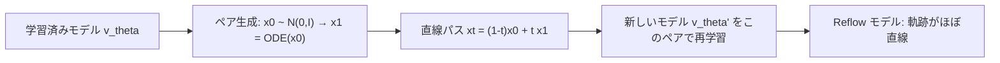
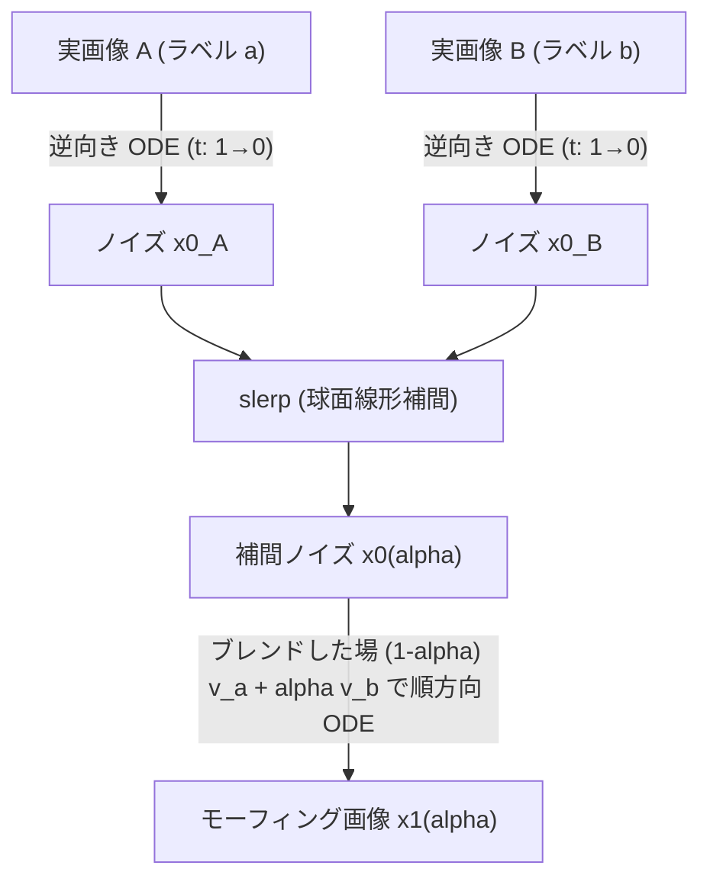

# Flow Matching 検証まとめ

このセッションで行った Flow Matching (Conditional Flow Matching / Rectified Flow) の
実装・実験・検証を、時系列に沿ってまとめたもの。コード本体の使い方は
[README.md](README.md) を参照。

> **Note:** 本文中の画像リンク (`out/...`) はリポジトリには含まれていない
> (生成物のため `.gitignore` 対象)。対応するスクリプトを実行すると
> 同じパスに自動生成される。

## 目次

1. [基本アルゴリズム](#1-基本アルゴリズム)
2. [2D トイデータでの実験 (two moons)](#2-2d-トイデータでの実験-two-moons)
3. [条件付き生成と Classifier-Free Guidance (CFG)](#3-条件付き生成と-classifier-free-guidance-cfg)
4. [「直線を学習する」の正確な意味と Reflow](#4-直線を学習するの正確な意味と-reflow)
5. [速度場の比較と時間変化](#5-速度場の比較と時間変化)
6. [速度場の不安定性 (データが疎な領域)](#6-速度場の不安定性-データが疎な領域)
7. [MNIST への拡張](#7-mnist-への拡張)
8. [低次元への写像で見る: PCA vs t-SNE](#8-低次元への写像で見る-pca-vs-t-sne)
9. [MNIST 版 Reflow](#9-mnist-版-reflow)
10. [ノイズ空間でのモーフィング (ODE 逆変換)](#10-ノイズ空間でのモーフィング-ode-逆変換)
11. [CFG のメカニズム](#11-cfg-のメカニズム)
12. [今後の高速化アイデア](#12-今後の高速化アイデア)
13. [参考文献](#13-参考文献)

---

## 1. 基本アルゴリズム

ノイズ分布 $p_0=\mathcal N(0,I)$ からデータ分布 $p_1$ へ運ぶ速度場 $v_\theta(x,t)$ を学習する。

**直線パス (OT / Rectified Flow)**

$$x_t = (1-t)\,x_0 + t\,x_1,\qquad x_0\sim\mathcal N(0,I),\; x_1\sim p_{\text{data}},\; t\sim U(0,1)$$

このパスに沿った条件付き速度は時刻によらず定数 $u_t=x_1-x_0$。

**CFM 損失**

$$\mathcal L = \mathbb E_{t,x_0,x_1}\left\|v_\theta(x_t,t)-(x_1-x_0)\right\|^2$$

条件付き速度への回帰だが、その最小化解は周辺確率経路を生成するベクトル場に一致する
(Flow Matching の肝)。実装は実質 6 行:

```python
x0 = torch.randn_like(x1)
t  = torch.rand(x1.shape[0], device=x1.device)
xt = (1 - t[:, None]) * x0 + t[:, None] * x1
target = x1 - x0
loss = (model(xt, t) - target).pow(2).mean()
```

**サンプリング**は ODE $\frac{dx}{dt}=v_\theta(x,t)$ を $t:0\to1$ で数値積分するだけ。
拡散モデルと違い途中でノイズを足さない (決定論的)。



---

## 2. 2D トイデータでの実験 (two moons)

`scripts/2d_basic/flow_matching_2d.py` で two moons を学習し、`make_gif_2d.py` で
生成過程を GIF 化した。


左: ノイズから two moons へ流れるサンプル。右: その時刻の速度場 $v_\theta(x,t)$。
$t$ が進むにつれベクトル場が三日月形へ収束していく。

---

## 3. 条件付き生成と Classifier-Free Guidance (CFG)

`scripts/conditional/flow_matching_conditional.py` で 8 gaussians をクラス条件生成。
学習時に確率 `p_uncond` (既定 0.1) でラベルを null トークンへ置き換え、生成時に

$$v_{\text{cfg}} = v_\theta(x,t,\varnothing) + (1+w)\bigl(v_\theta(x,t,y)-v_\theta(x,t,\varnothing)\bigr)$$

を使う (拡散モデルの CFG と同じ形)。


**同じ初期ノイズ**から CFG $w=0$ と $w=3$ で並走させた比較。$w=3$ 側は早い段階で
モードへ分離し、最後は分布が潰れる (多様性の低下)。メカニズムの詳細は
[11. CFG のメカニズム](#11-cfg-のメカニズム) を参照。

---

## 4. 「直線を学習する」の正確な意味と Reflow

よくある誤解: **学習される速度場の軌跡が直線になるわけではない。**

- 直線なのは訓練時の**条件付き**パス $x_t=(1-t)x_0+tx_1$ (ペアを固定したときの経路)
- 学習されるのはその周辺化 $v_\theta(x,t)\approx\mathbb E[x_1-x_0\mid x_t=x]$。$x_0$ と
  $x_1$ を独立にサンプリングしているため経路が大量に交差し、交差点で平均が取られる
  → **軌跡は曲がる**

`scripts/2d_basic/straightness.py` の実測値 (two moons, 2000 サンプル):

| 指標 | CFM | Reflow 1 回後 |
|---|---:|---:|
| 始点-終点の弦からの平均ずれ (弦長比) | 0.606 | 0.006 |
| 同・最大ずれ | 0.978 | 0.0096 |
| 直線性 $S=\mathbb E\int\|v(x_t,t)-(x_1-x_0)\|^2dt$ | 0.843 | 0.0002 |
| 1 ステップ Euler → 実データ最近傍距離 | 0.330 | 0.023 |
| 50 ステップ Euler → 同上 | 0.016 | 0.021 |

**Reflow** は学習済みモデルが作ったペア $(x_0,\mathrm{ODE}(x_0))$ を決定論的カップリングとして
再学習する。このペアでは経路が交差しないので周辺速度がほぼ定数になり、軌跡が直線化して
1 ステップ生成が成立する。


左上: CFM の軌跡 (曲線)。右上: Reflow 後の軌跡 (ほぼ直線)。左下: CFM の 1-step Euler
(原点付近に潰れる)。右下: Reflow 後の 1-step Euler (two moons の形が出る)。



軌跡を実際に少数サンプルで追ったのが `trace_points.py`:


---

## 5. 速度場の比較と時間変化

`scripts/2d_basic/compare_fields.py` で CFM と Reflow 後の速度場を $t=0,0.25,0.5,0.75,1$
で streamplot 比較。


- 上段 (CFM): $t=0$ では原点付近へ吸い込む形だったのが、$t$ が進むにつれ三日月に沿う形へ
  **作り変わっていく**
- 下段 (Reflow): $t<1$ の間ほぼ同じ形のまま (= 場が時間にほぼ依存しない → 軌跡が直線)

時間変化の数値化には測り方に注意が必要だった:

| 測り方 | CFM | Reflow 後 |
|---|---:|---:|
| (A) 一様グリッド上の $\|v-\overline{v}^t\|$ | 0.737 | 0.775 |
| (B) 実際に流れが通る点 $x_t$ 上の $\|v(x_t,t)-\overline{v}^t\|$ | 0.783 | **0.009** |

(A) で差が出ないのは、各時刻で確率質量の無い領域 ($p_t$ のサポート外) の値が損失に効かず
学習で決まっていないため。直線性は (B) の意味で成立する。

---

## 6. 速度場の不安定性 (データが疎な領域)

`scripts/2d_basic/field_stability.py` で、独立に学習した 2 つのモデル (seed 違い) の
速度場がどれだけ食い違うかを、その点における訓練データ密度と突き合わせた。


**Pearson r = -0.590** (log 密度 vs 2 モデルの不一致)。密度が低いほど 2 モデルの答えが
割れる、はっきりした負の相関。訓練データ $x_t=(1-t)x_0+tx_1$ は「ノイズ点とデータ点を
結ぶ線分」上にしか存在しないため、データから離れた領域は疎な勾配しか受け取らず、
$v_\theta(x,t)$ はほぼ未定義 (= 初期化・学習の乱数任せの不安定な外挿) になる。

---

## 7. MNIST への拡張

`scripts/mnist/flow_matching_mnist.py` で 2D トイデータ版を MNIST (28x28 手書き数字) へ
拡張。速度場を MLP から小さな U-Net (GroupNorm + 残差ブロック、約1.7Mパラメータ) に
差し替え、クラスラベル (0-9) 条件付け + CFG も実装。8000 ステップ・GPU で約2分半、
loss は 2.0 → 0.16 まで低下。


**1 ステップでも読める数字が出る** — 直線的な CFM パスのおかげで極端に少ない
ステップ数でも崩壊しにくい。

生成過程の GIF (`make_gif_mnist.py`):


**速度場の可視化** (`field_mnist.py`): MNIST は空間が 784 次元なので矢印は描けないが、
$v_\theta(x_t,t)$ は $x_t$ と同じ形 (画像) を持つので、そのまま発散カラーマップで
表示できる。


見た目には $t$ が変わっても模様があまり変わらないように見えるが、実測すると
$\|v_0-v_{49}\|$ は全体ノルムの 6 割程度あり、しっかり時間変化している (ノイズ由来の
高周波成分が同じ色スケールで支配的に見えるだけ)。

---

## 8. 低次元への写像で見る: PCA vs t-SNE

`scripts/mnist/feature_space_mnist.py`。784 次元の中の動きを 2 次元に写像して俯瞰する。
**PCA と t-SNE では扱いが本質的に違う**:

- **PCA は線形写像** $y=P(x-\bar x)$。線形なので $\frac{dy}{dt}=P\frac{dx}{dt}=Pv_\theta(x,t)$
  が厳密に成り立つ。速度ベクトルもそのまま射影でき、**ちゃんとした矢印場**が描ける
- **t-SNE は非線形**。この関係が成り立たず、速度ベクトルを射影する数学的根拠がない。
  できるのは「実際の軌跡上の点」の位置を追うことだけ

### PCA: 軌跡と速度場


明確な吸引構造 (sink) が見え、実際のサンプルもその流れに沿って動く。データが疎な領域
(特に $t\to1$ 付近) は矢印の**大きさ**が暴れやすい (6節と同じ現象) ので、GIF 版では
向きだけ揃えて長さを一定にし、大きさは色 (log スケール) で表している。

### PCA + 実画像を併記した強化版

サンプルを 4 個 (クラス 0, 3, 6, 8 を 1 個ずつ) に絞り、PCA 平面上の位置と、その時点の
実際の画像を同期させたもの。


上段の軌跡と下段の画像が完全に同期しており、「PCA平面上のこの位置にいるとき、実際には
こういう画像だった」を直接対応づけて見られる。

### t-SNE: 軌跡とジグザグ現象


t-SNE の軌跡アニメーションでは、点が細かく行ったり来たりする「ジグザグ」が見える。
これは ODE の 1 ステップあたりの移動量が小さく (隣接する $x_t$ はピクセル空間で
ほぼ重複点)、t-SNE が「どの点がどの点の近傍か」という確率だけを再現する最適化なので、
ほぼ同じ距離にある点の細かい並び順は最適化のノイズ (反発力・勾配降下) 任せになる
ためである。実測で確認した:

| 指標 | ピクセル空間 (784次元) | PCA 空間 | t-SNE 空間 |
|---|---:|---:|---:|
| 隣接ステップの移動方向コサイン類似度 (平均) | 1.000 | 1.000 | **-0.180** |
| 同・最小値 | 0.996 | 0.996 | -0.987 |
| 移動方向が逆転する割合 | 0% | 0% | **63%** |
| 1 ステップ移動量の変動係数 | 0.013 | 0.064 | 0.388 |

PCA は線形写像なので他の点と無関係に $x$ ごとに固定の行列を掛けるだけ (ノイズが
入り込む余地がない)。t-SNE は全点を同時に見て反復最適化するアルゴリズムなので、
ほぼ重複した点の並び順がノイズ任せになる。**「マクロには意味のある動き、ミクロには
ほぼランダムな順序」**というのが正確な理解であり、PCA の方が Flow Matching の
挙動 (速度場・軌跡の直線性など) を見るには忠実で、t-SNE は「生成結果が正しいクラスの
塊に着地しているか」という分類的サニティチェック専用と割り切るべき。

---

## 9. MNIST 版 Reflow

`scripts/mnist/reflow_mnist.py`。2D 版 (4節) と同じ手順を MNIST に適用。

1. 学習済みモデルで決定論的ペア $(x_0, y, x_1{=}\mathrm{ODE}(x_0\mid y))$ を 8000 組生成
2. その直線パスで新しい速度場を再学習 (6000 ステップ、loss 1.77 → 0.01。ラベル
   ドロップアウトも維持するので CFG は再学習後も使える)

実測 (300 サンプル、ODE 60 ステップ):

| 指標 | base (CFM) | reflow 後 |
|---|---:|---:|
| 弦からの平均ずれ (弦長比) | 0.0448 | **0.0244** |
| 弦からの最大ずれ (弦長比) | 0.0659 | **0.0378** |

reflow モデルで 8 節の「PCA + 実画像」図を描き直したもの:


base 版と見比べると、特に class 3 と class 8 の軌跡が PCA 平面上でほぼ一直線になって
いるのがわかる。下段の画像 (生成品質) 自体は base 版とほぼ同じで、**同じ生成品質の
まま経路だけが直線に近づいた**ことが確認できる。

---

## 10. ノイズ空間でのモーフィング (ODE 逆変換)

`scripts/mnist/morph_mnist.py`。Flow Matching の ODE は拡散モデルの SDE と違って
決定論的かつ可逆。実データの画像から時間を逆向きに ODE を解けば、対応するノイズを
(近似的に) 復元できる (DDIM inversion と同じ発想)。



手順:

1. 数字A・数字Bの実画像を、それぞれ自分のクラスラベルで逆向きに ODE を解いてノイズ
   $x_0^A, x_0^B$ を求める (inversion)
2. 2 つのノイズを球面線形補間 (slerp) する。高次元ガウスノイズは単純な線形補間だと
   中間点だけノルムが縮んで崩れた画像になりやすいため slerp を使う
3. 補間したノイズを、2 クラスの条件付き速度場を同じ比率でブレンドした場で順方向に
   解く (alpha=0 で数字Aの再構成、alpha=1 で数字Bの再構成)


3→8, 4→9, 1→7 のいずれも、書体の太さ・傾きといったスタイルを保ったまま滑らかに
変形する ("3"の下のループがそのまま"8"の下半分に繋がる、"1"の斜線が"7"の斜線として
引き継がれる、など)。

**inversion の精度確認**: alpha=0 (元のノイズをそのまま再デコードしたもの) と元の
実画像を比較すると、60 ステップで RMSE 0.0007 程度とほぼ完全に一致する。ODE が
決定論的で、誤差要因が数値積分の離散化誤差だけであることの裏付けでもある。

---

## 11. CFG のメカニズム

CFG (Classifier-Free Guidance) は、条件あり・条件なしの 2 通りの予測の**差分**を
利用する。この差分にはベイズの定理から導かれる裏付けがある。

Flow Matching の $v_\theta(x,t,y)$ は拡散モデルのスコア $\nabla_x\log p_t(x\mid y)$ と
同じ役割を果たす。ベイズの定理

$$\log p_t(y\mid x)=\log p_t(x\mid y)-\log p_t(x)+\text{const}(y)$$

の両辺を $x$ で微分すると

$$\nabla_x\log p_t(y\mid x)=\nabla_x\log p_t(x\mid y)-\nabla_x\log p_t(x)$$

つまり **$v_{\text{cond}}-v_{\text{uncond}}$ は、モデルが暗黙に持つ「分類器」
$p_t(y\mid x)$ の対数尤度の勾配そのもの**である。分類器を別途学習しなくても、
条件付き・条件なしの 2 通りを学習するだけで分類器の勾配が手に入る、というのが
Classifier-**Free** の意味。

外挿係数 $(1+w)$ をかけてこの方向に余分に進むと、実質的に次のように強調された
分布からサンプリングしていることになる:

$$p_w(x\mid y)\;\propto\;p(x\mid y)\cdot p(y\mid x)^w$$

$p(y\mid x)^w$ の部分が「モデル自身の暗黙の分類器がクラス $y$ だと確信している度合い」
を $w$ 乗で強調する項。$w$ を上げるほど分布が先鋭化 (mode-seeking) し、典型的な
サンプルに集中する (= クラスらしさは増すが多様性は落ちる)。3 節の GIF で $w=3$ 側の
分布が潰れたのはこの効果。

また CFG は 1 ステップごとに条件あり・条件なしの**2 回のフォワード計算**が必要
(計算コストが単純に 2 倍になる) — [12 節](#12-今後の高速化アイデア) の
「guidance 蒸留」はここを 1 回に減らす手法。

---

## 12. 今後の高速化アイデア

Reflow 以外にも、Flow Matching / 拡散モデルの生成を高速化する手段はいくつかある。

| カテゴリ | 手法 | 概要 |
|---|---|---|
| サンプラー側 (再学習不要) | 高次・適応刻み幅 ODE ソルバー (DPM-Solver++, DEIS 等) | 拡散/フローODEの半線形構造を利用し、再学習なしで10〜20ステップまで削減 |
| サンプラー側 | guidance 蒸留 | CFG の条件あり・条件なし 2 回のフォワードを 1 回に蒸留し、計算量を半分に |
| モデル再学習 (蒸留) | Consistency Models / Consistency Distillation | ODE軌跡上のどの点からもワンステップで終点に飛べるよう自己無矛盾性を学習 |
| モデル再学習 | Progressive Distillation | 生徒モデルが教師の2ステップ分を1ステップで模倣、を繰り返し半減 |
| モデル再学習 | Adversarial Diffusion Distillation (ADD, SDXL-Turbo) / DMD, DMD2 | GAN損失・分布マッチング損失で1〜4ステップ生成 |
| モデル再学習 | InstaFlow | Reflow (直線化) の先にさらに蒸留を重ね、1ステップ生成まで踏み込む |
| 学習側の工夫 | 時刻 $t$ のサンプリング分布 (logit-normal 等) | 同じステップ数でも生成品質が向上 (SD3 等で採用) |
| 学習側の工夫 | ミニバッチ最適輸送カップリング (Tong et al.) | $x_0,x_1$ をバッチ内で最適輸送させてからペアにし、最初から軌跡を素直にする |
| システム側 | 潜在空間での実行 (VAE 潜在上で Flow Matching、SD3/Flux と同じ) | ステップ数でなく1ステップあたりのコストを削減 |
| システム側 | 特徴キャッシュ (DeepCache 等) | 隣接タイムステップでのU-Net浅層特徴の再利用 |
| システム側 | 並列サンプリング (ParaDiGMS 等) | 複数タイムステップを固定点反復で同時に解き、GPU並列でレイテンシ削減 |

---

## 13. 参考文献

- Lipman et al., *Flow Matching for Generative Modeling*, ICLR 2023
- Liu et al., *Flow Straight and Fast: Learning to Generate and Transfer Data with Rectified Flow*, 2022
- Tong et al., *Improving and Generalizing Flow-Based Generative Models with Minibatch OT*, TMLR 2024
- Esser et al., *Scaling Rectified Flow Transformers for High-Resolution Image Synthesis* (SD3), 2024
- Ho & Salimans, *Classifier-Free Diffusion Guidance*, NeurIPS Workshop 2021
- Song et al., *Denoising Diffusion Implicit Models* (DDIM inversion の原典), ICLR 2021
