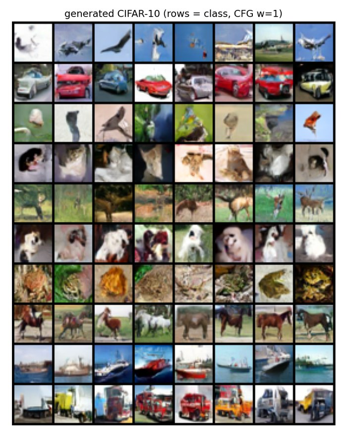
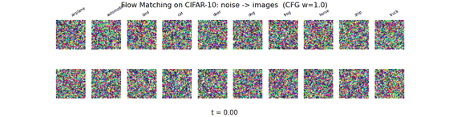

# Flow Matching サンプルコード

PyTorch による Flow Matching (Conditional Flow Matching / Rectified Flow) の最小実装。
2次元トイデータなので CPU でも数十秒〜数分で動く。

## ディレクトリ構成

意味の単位 (2D 基本 / 条件付き / MNIST) でサブディレクトリを分けている。
`scripts/<group>/` 内のスクリプトはそのフォルダから直接実行する
(`cd scripts/2d_basic && python xxx.py` のように)。出力・チェックポイントは
自動的に対応する `out/<group>/` に書き出される。

```
scripts/
  2d_basic/                      基本版 (two moons) 一式
    flow_matching_2d.py            学習 + ODE サンプリング + 軌跡可視化
    make_gif_2d.py                 生成過程の GIF
    straightness.py                軌跡の直線性の実測 + Reflow
    compare_fields.py              CFM と Reflow 後の速度場比較
    trace_points.py                固定サンプル点の追跡比較
    field_stability.py             速度場の不安定性の実測
  conditional/                   条件付き版 (8 gaussians + CFG) 一式
    flow_matching_conditional.py   学習 + クラス条件生成
    make_gif_conditional.py        CFG 比較の GIF
  mnist/                         MNIST 拡張一式
    flow_matching_mnist.py         学習 (U-Net) + 生成
    make_gif_mnist.py              生成過程の GIF
    field_mnist.py                 ピクセル単位の速度場可視化
    feature_space_mnist.py         PCA / t-SNE 平面への写像
    reflow_mnist.py                Reflow (決定論的ペアで再学習し軌跡を直線化)
    morph_mnist.py                 ODE 逆変換によるノイズ空間モーフィング
  cifar10/                       CIFAR-10 (32x32 カラー) 拡張
    flow_matching_cifar10.py       学習 (U-Net) + 生成 + 速度ベンチマーク
    make_gif_cifar10.py            生成過程の GIF
    dit_cifar10.py                 DiT (Vision Transformer) 版
    vae_cifar10.py                 潜在空間版の前段: 軽量VAE (32x32x3→16x16x4)
    flow_matching_cifar10_latent.py 潜在空間版 Flow Matching (SD3/Flux と同じ構成)

out/
  2d_basic/       flow_matching_2d.png/.gif, straightness.png,
                  compare_fields.png/.gif, trace_points.png/.gif,
                  field_stability.png
  conditional/    flow_matching_conditional.png/.gif
  mnist/          mnist_grid.png, mnist_trajectory.png, mnist_steps.png,
                  mnist_denoising.gif, field_mnist.png/.gif,
                  pca_trajectories_mnist.png, pca_field_mnist.png,
                  tsne_trajectories_mnist.png
  cifar10/        cifar10_grid.png, cifar10_steps.png
```

チェックポイント (`scripts/<group>/checkpoints/`) と自動ダウンロードされる
データセット (`scripts/mnist/data/`, `scripts/cifar10/data/`) は、各スクリプトと
同じフォルダの下に初回実行時に自動生成される(いずれも `.gitignore` 済みで
リポジトリには含まれない)。

## 実行

```bash
pip install -r requirements.txt

cd scripts/2d_basic      && python flow_matching_2d.py --steps 5000 && python make_gif_2d.py
cd scripts/conditional   && python flow_matching_conditional.py --steps 4000 && python make_gif_conditional.py
```

Python 3.10 以上を想定(f-string の一部記法や `pathlib` の使い方に依存)。
CUDA があれば自動で使う。CPUのみでも 2D 系(`2d_basic/`, `conditional/`)は
数十秒〜数分で完走する。MNIST/CIFAR-10系はGPU推奨。
主なオプションは `--steps` `--batch-size` `--lr` `--seed`。
チェックポイント (`scripts/<group>/checkpoints/`) があれば学習をスキップするので、
2 回目以降の実行は数秒〜数十秒で終わる。`--retrain` で強制的に学習し直す。

### GIF について

`make_gif_2d.py` / `make_gif_conditional.py` は ODE の各ステップを 1 フレームとして
描画する (既定 80 フレーム、20fps)。

- `flow_matching_2d.gif` — 左: ノイズから two moons へ流れるサンプル (尾は軌跡)、右: その時刻の速度場 $v_\theta(x,t)$。$t$ が進むにつれベクトル場が三日月形へ収束していく様子が見える。
- `flow_matching_conditional.gif` — **同じ初期ノイズ** から CFG $w=0$ と $w=3$ で並走させた比較。$w=3$ 側は早い段階でモードへ分離し、最後は分布が潰れる (多様性の低下)。

オプション (共通):

```bash
python make_gif_2d.py --ode-steps 120      # フレーム数を増やす (滑らかになるがファイルも大きくなる)
python make_gif_2d.py --retrain            # チェックポイントを無視して再学習
```

既定設定での GIF は 4〜5 MB 程度。軽くしたい場合は `--ode-steps` を減らすか、
`make_gif_2d(..., n_points=...)` の点数を下げる。

## アルゴリズム

ノイズ分布 $p_0=\mathcal N(0,I)$ からデータ分布 $p_1$ へ運ぶ速度場 $v_\theta(x,t)$ を学習する。

**1. 直線パス (OT / Rectified Flow)**

$$x_t = (1-t)\,x_0 + t\,x_1,\qquad x_0\sim\mathcal N(0,I),\; x_1\sim p_{\text{data}},\; t\sim U(0,1)$$

このパスに沿った条件付き速度は時刻によらず定数:

$$u_t(x_t\mid x_0,x_1)=\frac{dx_t}{dt}=x_1-x_0$$

**2. CFM 損失**

$$\mathcal L = \mathbb E_{t,x_0,x_1}\left\|v_\theta(x_t,t)-(x_1-x_0)\right\|^2$$

条件付き速度への回帰だが、その最小化解は周辺確率経路を生成するベクトル場に一致する
(これが Flow Matching の肝)。実装は実質 6 行:

```python
x0 = torch.randn_like(x1)
t  = torch.rand(x1.shape[0], device=x1.device)
xt = (1 - t[:, None]) * x0 + t[:, None] * x1
target = x1 - x0
loss = (model(xt, t) - target).pow(2).mean()
```

**3. サンプリング**

$$\frac{dx}{dt}=v_\theta(x,t),\qquad x(0)\sim\mathcal N(0,I)$$

を $t:0\to1$ で数値積分するだけ。拡散モデルと違い途中でノイズを足さない (決定論的)。
`flow_matching_2d.py` には Euler (1次) と midpoint (2次) を用意した。直線パスの
おかげで軌跡がほぼ直線になり、5〜20 ステップでも形が崩れにくい。

## 条件付き生成と CFG

`flow_matching_conditional.py` では速度場を $v_\theta(x,t,y)$ とし、学習時に確率
`--p-uncond` (既定 0.1) でラベルを null トークンへ置き換える。生成時は

$$v_{\text{cfg}} = v_\theta(x,t,\varnothing) + (1+w)\bigl(v_\theta(x,t,y)-v_\theta(x,t,\varnothing)\bigr)$$

拡散モデルの CFG と同じ形。出力画像を見ると $w$ を上げるほど各モードが縮み、
多様性と条件忠実度のトレードオフ (over-saturation) がそのまま現れている。

## 「Flow Matching は直線を学習する」の正確な意味

よくある誤解: **学習される速度場の軌跡が直線になるわけではない。**

- 直線なのは訓練時の**条件付き**パス $x_t=(1-t)x_0+tx_1$ (ペアを固定したときの経路)
- 学習されるのはその周辺化 $v_\theta(x,t)\approx\mathbb E[x_1-x_0\mid x_t=x]$。$x_0$ と $x_1$ を
  独立にサンプリングしているため経路が大量に交差し、交差点で平均が取られる → **軌跡は曲がる**

`straightness.py` の実測値 (two moons, 2000 サンプル):

| 指標 | CFM | Reflow 1 回後 |
|---|---:|---:|
| 始点-終点の弦からの平均ずれ (弦長比) | 0.606 | 0.006 |
| 直線性 $S=\mathbb E\int\|v(x_t,t)-(x_1-x_0)\|^2dt$ | 0.843 | 0.0002 |
| 1 ステップ Euler → 実データ最近傍距離 | 0.330 | 0.023 |
| 50 ステップ Euler → 同上 | 0.016 | 0.021 |

**Reflow** は学習済みモデルが作ったペア $(x_0,\mathrm{ODE}(x_0))$ を決定論的カップリングとして
再学習する。このペアでは経路が交差しないので周辺速度がほぼ定数になり、軌跡が直線化して
1 ステップ生成が成立する (`straightness.png` の右下)。

### 速度場の比較 (`compare_fields.py`)

`compare_fields.png` は $t=0,0.25,0.5,0.75,1$ の速度場を上段 CFM / 下段 Reflow 後で並べたもの。

- 上段: $t=0$ では原点付近へ吸い込む形だったのが、$t$ が進むにつれ三日月に沿う形へ**作り変わっていく**
- 下段: $t<1$ の間ほぼ同じ形のまま (= 場が時間にほぼ依存しない → 軌跡が直線)

時間変化の数値化には測り方に注意が必要:

| 測り方 | CFM | Reflow 後 |
|---|---:|---:|
| (A) 一様グリッド上の $\|v-\overline{v}^t\|$ | 0.737 | 0.775 |
| (B) 実際に流れが通る点 $x_t$ 上の $\|v(x_t,t)-\overline{v}^t\|$ | 0.783 | **0.009** |

(A) で差が出ないのは、各時刻で確率質量の無い領域 ($p_t$ のサポート外) の値が損失に効かず
学習で決まっていないため。特に $t=1$ ではデータ多様体の外がほぼ全部それに当たり、
`compare_fields.png` 下段右端が乱れているのもこれが理由。直線性は (B) の意味で成立する。

## MNIST への拡張 (`scripts/mnist/flow_matching_mnist.py`)

2D トイデータ版と **損失・ODE サンプリングは完全に同一**。変わるのは
速度場 $v_\theta$ を MLP から画像用の小さな U-Net (GroupNorm + 残差ブロック,
28→14→7→14→28 の解像度、約1.7Mパラメータ) に差し替え、入力が
1x28x28 の画像になる点だけ。クラスラベル (0-9) 条件付け + CFG も
`flow_matching_conditional.py` と同じ仕組みで実装している。

```bash
pip install torchvision   # requirements.txt に含まれるが単体でも可 (初回は scripts/mnist/data/ に自動ダウンロード)
cd scripts/mnist
python flow_matching_mnist.py --steps 8000
```

RTX 環境で 8000 ステップ・約 2 分半、loss は 2.0 → 0.16 まで低下。

出力:

- `mnist_grid.png` — 0〜9 を各8枚、CFG w=1 で生成。実測で崩れなく読める数字が生成できた
- `mnist_trajectory.png` — クラス7を固定し、ノイズ (t=0) から数字が浮かび上がる過程を6サンプル分並べたもの。t=0.4 あたりから輪郭が見え始め、t=0.6〜0.8 でほぼ確定する
- `mnist_steps.png` — Euler 1/2/4/10/50 ステップでの生成品質比較。**1ステップでも読める数字が出る** — 2D トイデータと同様、直線的な CFM パスのおかげで極端に少ないステップ数でも崩壊しにくい

`--retrain` で再学習、`--base-ch` でネットワーク幅、`--p-uncond` でラベルドロップ率を変更できる。
`straightness.py` / `field_stability.py` と同じ発想の実験(Reflow・速度場の不安定性の実測)も、
このスクリプトの `UNetVelocity` と `sample_ode` をそのまま使えば同様に組める。

### GIF (`scripts/mnist/make_gif_mnist.py`)

`make_gif_2d.py` (2D 版) と全く同じ作り方: ODE を `steps` 分割し midpoint 法で積分、
各時刻の画像を全部保持しておいて `FuncAnimation` の 1 フレーム = 1 ステップに
割り当て、`PillowWriter` で `.gif` に書き出すだけ。2D 版との違いは描画対象が
散布図 (`scatter`) ではなく画像 (`imshow`) という点のみ。

```bash
python make_gif_mnist.py                        # 0-9 x 3 サンプルが同時に浮かび上がる
python make_gif_mnist.py --samples-per-class 1   # 軽量版 (10 桁のみ)
python make_gif_mnist.py --dpi 80                # ファイルサイズを下げる (既定 100)
```

`mnist_denoising.gif` は t=0.4〜0.7 あたりで一気に数字の形が出てくる。
GIF 化の一般的な型は次の 3 ステップ:

1. ODE の各ステップの状態を `torch.stack(...)` で全部メモリに保持する
2. 描画要素 (imshow / scatter / quiver など) を 1 回だけ作り、
   `update(i)` の中で `set_data` / `set_offsets` / `set_UVC` を呼んで中身だけ差し替える
   (matplotlib オブジェクトを毎フレーム作り直すと遅い)
3. `FuncAnimation(fig, update, frames=...)` → `anim.save(path, writer=PillowWriter(fps=...))`

最後に同じフレームを `HOLD_FRAMES` 回繰り返すと、ループ再生したときに
完成形で一瞬止まって見やすくなる。

### 速度場の可視化 (`scripts/mnist/field_mnist.py`)

2D トイデータでは空間が $(x,y)$ の 2 次元だったので、各点に矢印 $v_\theta(x,t)\in\mathbb R^2$
を描けた (`compare_fields.py`)。MNIST は空間が 784 次元 (28x28 ピクセル) なので、
1 点における速度ベクトルも 784 次元になり矢印には描けない。

ただし $v_\theta(x_t,t)$ は $x_t$ と全く同じ形 (1x28x28) を持つ。つまり
「各ピクセルを今後どちらにどれだけ動かすか」をそのまま画像として
(発散カラーマップ `RdBu_r` で正負を色分けして) 表示できる。これが
高次元版の「速度場」の可視化になる。

```bash
python field_mnist.py --label 3
```

`field_mnist.png` / `.gif` は上段に $x_t$、下段に $v_\theta(x_t,t)$ を並べる。
見た目には $t$ が変わっても速度場の模様があまり変わらないように見えるが、
実測すると $\|v_0 - v_{49}\|$ は全体ノルムの 6 割程度あり、しっかり時間変化している
(`field_stability.py` の議論と同じで、ノイズ由来の高周波成分が同じ色スケールで
支配的に見えるだけ)。大まかな構造は早い段階でほぼ決まり、細部だけが後から
詰まっていく — 拡散モデルの典型的な挙動と同じ。

### 低次元への写像で見る (`scripts/mnist/feature_space_mnist.py`)

`field_mnist.py` はピクセル単位の速度を画像として見る方法だったが、
「784次元空間の中を軌跡や速度場がどう動くか」を低次元に写像して俯瞰する
こともできる。ただし **PCA と t-SNE では扱いが本質的に違う**:

- **PCA は線形写像** $y=P(x-\bar x)$。線形なので $\frac{dy}{dt}=P\frac{dx}{dt}=Pv_\theta(x,t)$
  が厳密に成り立つ。つまり速度ベクトルもそのまま射影でき、2D トイデータのときと
  **同じ streamplot が「ちゃんとした矢印場」として描ける**。さらに $P$ の疑似逆
  写像でグリッド点を画像へ持ち上げてモデルを評価すれば、平面全体の場を可視化できる
- **t-SNE は非線形**なのでこの関係が成り立たず、速度ベクトルを射影する数学的
  根拠がない。できるのは「実際の軌跡上の点」を埋め込んで位置を追うことだけ
  (矢印場は作れない)

```bash
python feature_space_mnist.py             # PCA 2枚 + t-SNE 1枚 (静止画)
python feature_space_mnist.py --no-tsne   # t-SNE は重いので省略したい場合
python feature_space_mnist.py --gif       # GIF も作る (静止画に加えて)
```

出力 (静止画):

- `pca_trajectories_mnist.png` — 実データを PCA 平面に散布し、その上に生成軌跡
  (○=ノイズ, ✕=生成結果) を重ねる。MNIST 版の `trace_points.png` に相当
- `pca_trajectories_with_images_mnist.png` — 上の軌跡をサンプル4個 (クラス0,3,6,8を
  1個ずつ) に絞り、代わりに各サンプルの実画像がどう変化するかをフィルムストリップ
  として下段に併記した強化版。上段の □ 番号と下段の列番号が対応しており、
  「PCA平面上のこの位置にいるとき、実際にはこういう画像だった」を直接対応づけて見られる
- `pca_field_mnist.png` — $t=0.2,0.5,0.8,0.99$ での速度場を PCA 平面上に streamplot
  として描画 (class=3)。明確な吸引構造 (sink) が見え、実際のサンプル (赤点) も
  その流れに沿って動いている。MNIST 版の `compare_fields.png` に相当
- `tsne_trajectories_mnist.png` — 実データ + 複数クラスの生成軌跡を t-SNE で
  同時埋め込み。各軌跡が正しいクラスのクラスタへ向かって伸びていく様子が
  PCA よりはっきり分離して見える (t-SNE はクラス分離を強調するため)。ただし
  矢印場は描けない点に注意

出力 (`--gif` 指定時):

- `pca_trajectories_mnist.gif` — 上の軌跡が実際に $t:0\to1$ で動く版
  (`trace_points.gif` の MNIST 版)
- `pca_trajectories_with_images_mnist.gif` — サンプル4個に絞り、上段の PCA 平面上の
  動きと下段の「今の画像」をリアルタイムで同期させたアニメーション版。
  静止画のフィルムストリップより、位置と見た目の対応がさらに直感的にわかる
- `pca_field_mnist.gif` — 速度場が $t$ とともに変化する様子を quiver で
  アニメーション化。streamplot は毎フレーム再計算すると重いため quiver に
  切り替えている。データが疎な領域 (特に $t\to1$ 付近) は矢印の**大きさ**が
  暴れやすい (`field_stability.py` と同じ現象) ので、矢印は向きだけ揃えて
  長さを一定にし、大きさは色 (log スケール) で表している
- `tsne_trajectories_mnist.gif` — t-SNE は非線形で毎フレーム再埋め込みすると
  点の位置が連続的に繋がらなくなる。そのため 1 回だけ密な時刻マークで
  同時埋め込みし、その固定された 2D 位置の上を点が動くアニメーションにしている
  (軌跡がジグザグして見えるのは t-SNE 特有の見た目で、物理的な意味はない)

PCA は上位2成分しか使わないため、生成された数字が本当に「合っている」かの
判定には情報量が足りず、クラス同士がかなり重なる。t-SNE は非線形ゆえに
クラスをきれいに分離するが、速度場という物理的な意味は失われる — 目的に応じて
使い分けるとよい。

### Reflow で軌跡を直線化する (`scripts/mnist/reflow_mnist.py`)

`scripts/2d_basic/straightness.py` と全く同じ考え方を MNIST に適用する。

1. 学習済みモデルで決定論的ペア $(x_0, y, x_1{=}\mathrm{ODE}(x_0\mid y))$ を大量に生成
2. その直線パス $x_t=(1-t)x_0+tx_1$ で新しい速度場を再学習 (ラベルドロップアウトも
   維持するので CFG は再学習後も使える)
3. `checkpoints/velocity_mnist_reflow1.pt` に保存

```bash
python reflow_mnist.py --n-pairs 8000 --train-steps 6000
```

8000 ペア生成 + 6000 ステップ学習で GPU 上数分。実測 (300 サンプル、ODE 60 ステップ):

| 指標 | base (CFM) | reflow 後 |
|---|---:|---:|
| 弦からの平均ずれ (弦長比) | 0.0448 | **0.0244** |
| 弦からの最大ずれ (弦長比) | 0.0659 | **0.0378** |

`pca_trajectories_with_images_mnist_reflow.png` / `.gif` は、この reflow モデルで
`pca_trajectories_with_images_mnist.png` / `.gif` を描き直したもの。base 版と見比べると、
特に class 3 と class 8 の軌跡が PCA 平面上でほぼ一直線になっているのがわかる。

```bash
python -c "
import torch
from pathlib import Path
from flow_matching_mnist import UNetVelocity, load_mnist_tensor
from feature_space_mnist import fit_pca, make_pca_trajectories_with_images, make_pca_trajectories_with_images_gif

device = torch.device('cuda' if torch.cuda.is_available() else 'cpu')
ckpt_dir = Path('checkpoints')  # scripts/mnist から実行する想定
reflow_model = UNetVelocity().to(device)
reflow_model.load_state_dict(torch.load(ckpt_dir / 'velocity_mnist_reflow1.pt', map_location=device))
reflow_model.eval()

images, labels = load_mnist_tensor(device)
idx = torch.randperm(images.shape[0])[:8000]
mean, comps = fit_pca(images[idx], n_components=2)
real_idx = torch.randperm(images.shape[0])[:4000]
real_sub, real_sub_labels = images[real_idx].cpu(), labels[real_idx].cpu()

out_dir = Path('../../out/mnist')
make_pca_trajectories_with_images(reflow_model, real_sub, real_sub_labels, mean.cpu(), comps.cpu(), device,
                                   out_dir / 'pca_trajectories_with_images_mnist_reflow.png')
make_pca_trajectories_with_images_gif(reflow_model, real_sub, real_sub_labels, mean.cpu(), comps.cpu(), device,
                                       out_dir / 'pca_trajectories_with_images_mnist_reflow.gif')
"
```

### ノイズ空間でのモーフィング (`scripts/mnist/morph_mnist.py`)

Flow Matching の ODE は拡散モデルの SDE と違って決定論的かつ可逆。実データの画像から
時間を逆向きに ODE を解けば、対応するノイズを (近似的に) 復元できる (DDIM inversion
と同じ発想)。この性質を使うと、2つの実数字をノイズ空間で補間しながらモーフィングできる。

手順:

1. 数字A・数字Bの実画像を、それぞれ自分のクラスラベルで逆向きに ODE を解いてノイズ
   $x_0^A, x_0^B$ を求める (inversion)
2. 2つのノイズを球面線形補間 (slerp) する。高次元ガウスノイズは単純な線形補間だと
   中間点だけノルムが縮んで崩れた画像になりやすいため slerp を使う
3. 補間したノイズを、2クラスの条件付き速度場を同じ比率でブレンドした場で順方向に解く
   (alpha=0 で数字Aの再構成、alpha=1 で数字Bの再構成、間はノイズ・クラス条件の両方が
   滑らかに混ざる)

```bash
python morph_mnist.py --steps 60
python morph_mnist.py --gif-pair 4 9   # GIF で使うペアを変える
```

出力:

- `morph_mnist.png` — 3→8, 4→9, 1→7 の3ペアを alpha=0〜1 で並べたグリッド。
  "3"の下のループがそのまま"8"の下半分に繋がる、"1"の斜線が"7"の斜線として
  引き継がれるなど、書体のスタイルを保ったまま滑らかに変形する
- `morph_mnist.gif` — 1ペア (既定 3↔8) を alpha 連続でモーフィングさせるアニメーション

**inversion の精度確認**: alpha=0 (=元のノイズをそのまま再デコードしたもの) と元の
実画像を比較すると、60ステップで RMSE 0.0007 程度とほぼ完全に一致する。これは
ODEが決定論的で誤差要因が数値積分の離散化誤差だけであることの裏付けでもある。

## CIFAR-10 への拡張 (`scripts/cifar10/flow_matching_cifar10.py`)

MNIST 版と損失・ODE サンプリングは完全に同一。U-Net も 32x32 -> 16x16 -> 8x8 ->
16x16 -> 32x32 と同じ 2 段ダウンサンプル構成がそのまま使え、変わるのは入出力
チャンネル数 (1 -> 3) と `base_ch` (64 -> 96, 約3.67Mパラメータ) だけ。CIFAR-10
は 10 クラスの物体 (飛行機・車・鳥・猫・鹿・犬・蛙・馬・船・トラック) で、
クラス条件付け + CFG も MNIST 版と同じ仕組み。

```bash
python flow_matching_cifar10.py --benchmark-steps 200   # まず速度だけ計測
python flow_matching_cifar10.py --steps 12000            # 本番学習
```

`--benchmark-steps` を指定すると、その場で計測したステップ時間から 4000 /
8000 / 16000 / 30000 ステップの所要時間を推定して終了する。GTX 1080 Ti
(Pascal, Tensor Core非搭載) での実測は 172ms/step (batch=128) で、
12000 ステップ (約32分) の学習で loss は 1.37 → 0.18 まで低下した。


MNIST ほどクッキリしないが (ぼやけた印象派的な絵)、各行 (クラスごと) の色調・
輪郭は明確にクラスに対応している (飛行機は空を背景に翼状の形、船は水平線と
船体、馬・鹿は四足動物の姿勢など)。370万パラメータ・GPU 32分というごく小さな
計算量でもここまで出るのは、直線的な CFM パスの学習効率の高さの表れ。

`cifar10_steps.png` でステップ数を減らした場合の崩れ方も確認できる。MNIST と
同様、1ステップでもクラスの色調は掴めており、2〜4ステップで輪郭がかなり
はっきりしてくる。

### 品質改善版 (v2): EMA + Attention + データ拡張

`--out-suffix _v2` (既定) で、以下の改善を加えた設定で学習できる:

- **EMA (重みの指数移動平均)**: 生成には学習中の重みそのものではなく、その
  移動平均を使う。拡散/フローモデルで生成品質を上げる定番手法
- **ボトルネック (8x8) への self-attention 追加**: 畳み込みだけでは捉えにくい
  大域的な構造 (物体全体の輪郭) を学習しやすくする
- **水平反転データ拡張**: 実質的にデータ量を2倍に
- **base_ch 96 → 128**: 3.67M → 7.93M パラメータ

実測では、これらを足しても 1 ステップの時間はほぼ変わらなかった (164.5ms/step
vs 172ms/step) — GTX 1080 Ti はこの規模ではまだ計算能力に余裕があったということ。
その分ステップ数を 12,000 → 30,000 に増やし、実測 82 分で学習した。

```bash
python flow_matching_cifar10.py --steps 30000   # v2 (既定)
```



v1 (`cifar10_grid.png`) と比べると、車の窓・ホイール・ボディの輪郭、馬のたてがみと
四肢の構造、船の船体とマストなど、細部がはっきりと見えるようになっている。

生成過程の GIF も v2 チェックポイントで作れる (`make_gif_cifar10.py` に
`--ckpt` / `--base-ch` / `--no-attn` を追加し、v1/v2 どちらのチェックポイントも
読めるようにしてある):

```bash
python make_gif_cifar10.py --ckpt velocity_cifar10_v2.pt --base-ch 128 --out cifar10_denoising_v2.gif
```



### GIF (`make_gif_cifar10.py`)

`make_gif_mnist.py` と全く同じ作り方。10 クラス x 2 サンプルが同時にノイズから
浮かび上がる。

```bash
python make_gif_cifar10.py
```


t=0.4 あたりから大まかな輪郭 (飛行機の機体、鳥の翼など) が見え始め、t=0.7〜1.0
で色や質感が確定していく。MNIST よりも t が進んでからの変化が大きい — カラー
画像は情報量が多く、細部の確定に時間がかかるということが視覚的にわかる。

## DiT (Vision Transformer) 版との比較 (`scripts/cifar10/dit_cifar10.py`)

U-Net を Vision Transformer (DiT, Peebles & Xie 2022 のミニ版) に置き換えた版。
損失・ODE サンプリング・EMA・データ拡張などのインフラは `flow_matching_cifar10.py`
からそのまま再利用し、ネットワークだけが違う。

- 32x32x3 画像を 4x4 パッチ (8x8=64トークン) に分割し線形射影
- 時刻+クラス条件は adaLN-Zero (各 Transformer ブロックでシフト・スケール・
  ゲートを変調) で注入。U-Net 版の「特徴マップに加算」より表現力が高い
- dim=256, depth=6, 約7.4Mパラメータ (U-Net v2 の7.93Mと同規模で比較用に設計)

**速度の実測**: GTX 1080 Ti でトークン数が少ない (64個) ぶん、同程度の
パラメータ数でも U-Net より高速だった。

| | U-Net v2 | DiT |
|---|---:|---:|
| パラメータ数 | 7.93M | 7.41M |
| 1ステップ (batch=128) | 156ms | 77.5ms (約2倍速) |
| GPU使用率 (batch=128) | 92〜96% | 92〜96% |
| GPU使用率 (batch=32) | — | 71〜73% |

バッチサイズを 128→64→32→16 と下げていくと GPU 使用率は素直に下がるが、
1ステップの時間は batch=16 あたりで下げ止まる (Python ループ側のオーバーヘッドが
支配的になるため)。今回は「画面描画用に GPU 使用率を少し空けたい」という
実用上の理由で batch=32・ステップ数はその分増やして (120,000 ステップ、
U-Net v2 と同じ384万サンプル相当) 学習した。実測 GPU 使用率は 61〜73%、
所要時間は約64分。

```bash
python dit_cifar10.py --benchmark-steps 200 --batch-size <N>   # 速度確認
python dit_cifar10.py --steps 120000 --batch-size 32           # 本番学習
```


U-Net v2 (`cifar10_grid_v2.png`) と見比べると、車の窓・ボディの反射や馬の
輪郭などは同等かそれ以上に鮮明で、この小規模・短時間の条件でも DiT が
U-Net に見劣りしないことが確認できた。事前の予想 (「畳み込みの帰納バイアスが
無い分、小規模条件では不利では」) は外れ、トークン数が少ない CIFAR-10 の
ような低解像度では Attention 主体のアーキテクチャでも十分学習できるようだ。

## 潜在空間版 (VAE + Flow Matching): SD3/Flux と同じ構成

「この解像度でも潜在空間に落とせるか」を実際に試した記録。SD3/Fluxは画像をVAEで
圧縮した潜在空間の中でFlow Matchingを行うが、CIFAR-10 (32x32) は元々小さいため、
標準的な8倍圧縮では 4x4 まで潰れて情報が失われすぎる。そこで**空間2倍・
チャンネル3→4の軽い圧縮** (32x32x3=3072次元 → 16x16x4=1024次元、約3倍圧縮)
に留めた自前VAEを用意した。

### 1. VAE (`scripts/cifar10/vae_cifar10.py`)

GroupNorm+SiLUの残差ブロックによる軽量エンコーダ/デコーダ (約0.89Mパラメータ)。
損失は再構成誤差(MSE) + KL項 (weight `--beta` は既定 1e-5 とごく小さく、
SD系VAEと同様「正規分布への近さ」より「再構成品質」を優先する設定)。

```bash
python vae_cifar10.py --steps 8000
```

実測 59.4ms/step、8000ステップ約8分で recon loss 0.0011 まで収束。


3倍圧縮でもほぼ見分けがつかないレベルで再構成できている。

### 2. 潜在空間での Flow Matching (`scripts/cifar10/flow_matching_cifar10_latent.py`)

学習済みVAEで全データを一度だけ潜在表現にエンコードしてキャッシュし (毎ステップ
VAEを通すと遅いため)、その 16x16x4 の潜在表現の上で `flow_matching_cifar10.py`
と全く同じ CFM 損失・EMA・データ拡張のコードを再利用する。速度場のU-Netも
チャンネル数 (3→4) を変えるだけでそのまま使い回せた (ハードコードされた
解像度が無いため 16→8→4 のダウンサンプルも無改造で動く)。生成時は潜在空間で
ODEを解いたあと、VAEデコーダでピクセルに戻す。

```bash
python flow_matching_cifar10_latent.py --steps 30000
```

実測 48.5ms/step (U-Net v2 のピクセル版 156ms/step の約3倍速)。30000ステップ
約24分で学習。


**事前の予想 (VAEのボケが品質上限になり不利では) は外れ**、車の窓・ホイール・
ボディパネル、馬の鞍や乗り手まで見えるなど、これまでの4パターン
(v1 / v2 / DiT / 潜在空間版) の中でも最も鮮明な結果になった。考えられる理由:

- VAEの再構成自体が高品質 (3倍程度の軽い圧縮なら情報損失がほぼ無い)
- 速度場が学習するのは 1024次元の潜在空間で、3072次元のピクセル空間より
  「予測すべきものがシンプル」になり、同じ計算量・ステップ数でも最適化が
  進みやすい可能性がある
- 計算コストが下がった分 (3倍速)、同じ時間予算ならより多くのステップを
  回せる

### まとめ表

| | v1 (baseline) | v2 (EMA+Attn+拡張) | DiT | 潜在空間版 |
|---|---:|---:|---:|---:|
| 空間 | ピクセル (32x32x3) | ピクセル (32x32x3) | ピクセル (32x32x3) | **潜在 (16x16x4)** |
| パラメータ数 | 3.67M | 7.93M | 7.41M | 7.94M (+VAE 0.89M) |
| 1ステップ (batch=128) | 172ms | 156ms | 77.5ms | **48.5ms** |
| 学習ステップ数 | 12,000 | 30,000 | 120,000 (batch=32) | 30,000 |
| 学習時間 | 32分 | 82分 | 64分 | 24分 (+VAE 8分) |
| 主観品質 | 低 (ぼやけた印象派風) | 良好 | 良好〜やや良好 | **最良** |

## 学習速度の実測: Pascal (Tensor Core非搭載) GPUでの高速化テクニック

「学習を速くしたい」と思ったときにまず試したくなる定番のテクニックを、
このGTX 1080 Ti (Pascal, compute capability 6.1) で実測した結果。

| 手法 | 効果 |
|---|---:|
| `torch.compile` | **使用不可** (Triton が compute capability 7.0 以上を要求、Pascal は 6.1) |
| `torch.backends.cudnn.benchmark = True` | 誤差範囲 (±2%) |
| `channels_last` メモリフォーマット | **-42% (悪化)** |
| fp16 混合精度 (AMP) | **-12% (悪化)** |
| EMA更新を毎ステップ→5ステップに1回に間引く | +2%程度 |
| バッチサイズ 128→256 | **+8.7% (1サンプルあたり)** |
| バッチサイズ 128→512 | +10.5% (頭打ち) |

**結論**: AMP・channels_last・torch.compile は全て Volta 以降の Tensor Core を
前提にした最適化であり、Pascal ではキャスト/変換のオーバーヘッドだけが乗って
むしろ悪化する。効果があったのはバッチサイズを上げることだけ (VRAM に余裕が
あるなら 256 程度が費用対効果の良い落とし所)。`flow_matching_cifar10_latent.py`
の既定バッチサイズはこの結果を受けて 128 → 256 に変更した。

「Pascal世代のGPUで学習を高速化したい」場合、モダンなGPU (Ampere以降) 向けの
チュートリアルに書いてある高速化テクニックをそのまま試すのは効果が薄いか
逆効果になりやすい、というのがこの実験からの実用的な教訓。

### 訂正: 「1サンプルあたりの速度」と「壁時計時間あたりのloss低下」は別物

上の表でバッチサイズ128→256が「+8.7% (1サンプルあたり)」と出たため、
一度は既定バッチサイズを256に変更した。しかし同じ壁時計時間 (3分ずつ) で
学習率を揃えて (linear scaling rule で256側は学習率も2倍にして) 実際に
loss の下がり方を比較したところ、**むしろ128の方が終始 loss が低かった**:

| 設定 | 3分間の更新回数 | 到達loss (直近100ステップ平均) |
|---|---:|---:|
| batch=128, lr=2e-4 (既定) | 3,753 | **0.4424** |
| batch=256, lr=2e-4 (素朴に据え置き) | 2,086 | 0.4543 |
| batch=256, lr=4e-4 (learning rate も比例して倍増) | 2,141 | 0.4447 |

理由: 1サンプルあたりの処理は256の方が効率的でも、同じ壁時計時間で見た
**勾配更新の回数**は128の方が圧倒的に多い (3,753 vs 2,100程度)。この学習量
(数千ステップ規模) では、更新回数の多さが1回あたりの効率の良さを上回った。
教訓として、**「スループット (samples/sec) を上げる変更」が必ずしも
「同じ時間でどれだけlossが下がるか」を改善するとは限らない**ため、変更後は
実際の loss 低下を壁時計時間で比較して検証する必要がある。既定バッチサイズは
128 に戻した。

### 同じ検証をモデルサイズ (base_ch) でも実施

「ブロック (base_ch) を大きくすれば品質が上がるのでは」という仮説も、
バッチサイズと同じ方法 (batch=128, lr=2e-4 固定、壁時計3分ずつ) で検証した:

| 設定 | パラメータ数 | 3分間のステップ数 | 到達loss (直近100ステップ平均) |
|---|---:|---:|---:|
| base_ch=128 (既定) | 7.94M | 2,741 | **0.4521** |
| base_ch=192 | 17.69M | 896 | 0.4798 |
| base_ch=256 | 31.30M | 458 | 0.5086 |

結果はバッチサイズのときと同じパターン。base_ch を上げるとブロックあたりの
計算量がチャンネル数のほぼ2乗で増え (128→256 でパラメータ数は約4倍、
1ステップの時間は3.35倍)、同じ3分間でこなせる更新回数が 2,741 → 896 → 458 と
激減する。表現力は上がっても更新回数の減少がそれを上回り、**この学習時間
スケール (数千ステップ) では base_ch を上げるほどむしろ loss が悪化した**。
「モデルを大きくすれば品質が上がる」も、学習時間を十分に確保できて初めて
成り立つ話であり、短時間の比較では逆効果になり得る、という教訓が
バッチサイズの場合と共通して得られた。

### 時刻 t のサンプリング分布を切り替え可能にした (`--t-dist`)

`cfm_loss` / `train` (U-Net・DiT・潜在空間版で共通) に `--t-dist {uniform,logit_normal}`
オプションを追加した。`logit_normal` は SD3 (Esser et al. 2024) と同じスケジュールで、
$u\sim\mathcal N(\text{mean},\text{std})$ を sigmoid で $(0,1)$ に写し、$t=0.5$ 付近
(ノイズと実データの中間、最も情報量の多い領域) を重点的にサンプリングする。
実測では t=0.4〜0.6 に入る割合が一様分布の20.5%からlogit_normalで31.3%に増加し、
速度への影響はほぼゼロ (追加コストがないので試す価値が高い)。壁時計時間での
loss 比較はまだ実施していない。

```bash
python flow_matching_cifar10_latent.py --t-dist logit_normal
```

## 実データへ広げるとき

- **モデル**: 画像なら MLP を U-Net や DiT に置き換える。損失とサンプリングのコードはそのまま使える。
- **潜在空間**: Stable Diffusion 3 / Flux 系は VAE 潜在上で同じ直線パスの Flow Matching を回している。
- **時刻分布**: 高解像度では $t\sim U(0,1)$ ではなく logit-normal サンプリングが使われることが多い。
- **ステップ削減**: Reflow (生成したペアで再学習) を繰り返すと軌跡がさらに直線化し、1〜4 ステップ生成に近づく。

## 参考文献

- Lipman et al., *Flow Matching for Generative Modeling*, ICLR 2023
- Liu et al., *Flow Straight and Fast: Learning to Generate and Transfer Data with Rectified Flow*, 2022
- Tong et al., *Improving and Generalizing Flow-Based Generative Models with Minibatch OT*, TMLR 2024
- Esser et al., *Scaling Rectified Flow Transformers for High-Resolution Image Synthesis* (SD3), 2024
