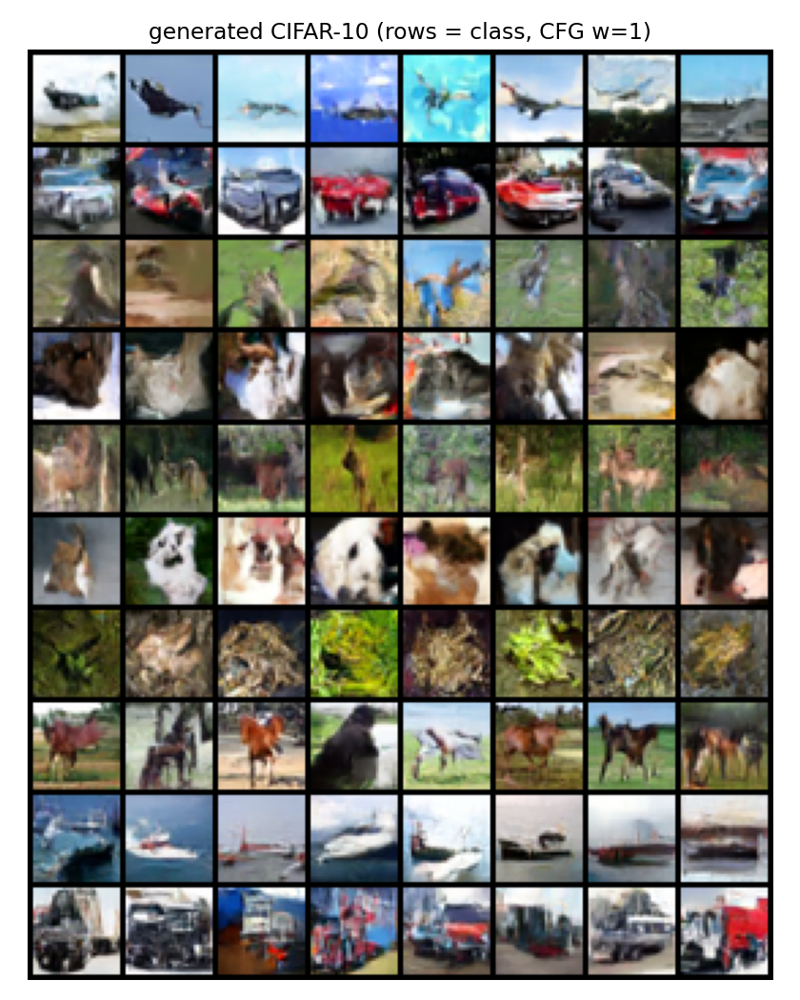

# Flow Matching サンプルコード

PyTorch による Flow Matching (Conditional Flow Matching / Rectified Flow) の実装・実験集。
2次元トイデータから始めて、条件付き生成・MNIST・CIFAR-10 (U-Net → DiT → 潜在空間) まで
同じ考え方を段階的に拡張している。各グループのコードと結果は、それぞれの
サブディレクトリの README にまとめてある。



*CIFAR-10 の10クラスをラベル条件付きで生成した例(`scripts/cifar10/` の DiT 実装)。行が各クラスに対応。*

## セットアップ

```bash
pip install -r requirements.txt
```

Python 3.10 以上を想定。CUDA があれば自動で使う。2D 系 (`2d_basic/`, `conditional/`)
は CPU でも数十秒〜数分で完走するが、MNIST/CIFAR-10 系は GPU 推奨。

## 構成

`scripts/<group>/` 内のスクリプトはそのフォルダから直接実行する
(`cd scripts/2d_basic && python xxx.py` のように)。チェックポイントと自動
ダウンロードされるデータセットは各スクリプトと同じフォルダの下に、生成された
図・GIF はリポジトリ直下の `out/<group>/` に、それぞれ初回実行時に自動生成される
(いずれも `.gitignore` 対象でリポジトリには含まれない)。

| グループ | 内容 | 詳細 |
|---|---|---|
| [`scripts/2d_basic/`](scripts/2d_basic/README.md) | two moons によるアルゴリズムの基本、軌跡の直線性の実測、Reflow、速度場の不安定性 | [README](scripts/2d_basic/README.md) |
| [`scripts/conditional/`](scripts/conditional/README.md) | 8 gaussians によるクラス条件生成、Classifier-Free Guidance (CFG) とそのベイズ的な裏付け | [README](scripts/conditional/README.md) |
| [`scripts/mnist/`](scripts/mnist/README.md) | U-Net への拡張、PCA/t-SNE 平面への写像、MNIST 版 Reflow、ノイズ空間モーフィング | [README](scripts/mnist/README.md) |
| [`scripts/cifar10/`](scripts/cifar10/README.md) | U-Net → DiT → VAE+潜在空間の3段階比較、GPU 速度の実測とその教訓 | [README](scripts/cifar10/README.md) |

## アルゴリズムの基本

ノイズ分布 $p_0=\mathcal N(0,I)$ からデータ分布 $p_1$ へ運ぶ速度場 $v_\theta(x,t)$ を、
直線パス $x_t=(1-t)x_0+tx_1$ 上の速度 $x_1-x_0$ への回帰として学習する
(実装は実質 6 行):

```python
x0 = torch.randn_like(x1)
t  = torch.rand(x1.shape[0], device=x1.device)
xt = (1 - t[:, None]) * x0 + t[:, None] * x1
target = x1 - x0
loss = (model(xt, t) - target).pow(2).mean()
```

生成時は ODE $\frac{dx}{dt}=v_\theta(x,t)$ を $t:0\to1$ で数値積分するだけ (拡散モデルと
違い途中でノイズを足さない、決定論的なプロセス)。詳しい導出・実測・落とし穴は
[scripts/2d_basic/README.md](scripts/2d_basic/README.md) にまとめてある。

## 実データへ広げるとき

- **モデル**: 画像なら MLP を U-Net や DiT に置き換える。損失とサンプリングのコードはそのまま使える。
- **潜在空間**: Stable Diffusion 3 / Flux 系は VAE 潜在上で同じ直線パスの Flow Matching を回している ([cifar10](scripts/cifar10/README.md#潜在空間版-vae--flow-matching-sd3flux-と同じ構成) で再現)。
- **時刻分布**: 高解像度では $t\sim U(0,1)$ ではなく logit-normal サンプリングが使われることが多い。
- **ステップ削減**: Reflow (生成したペアで再学習) を繰り返すと軌跡がさらに直線化し、1〜4 ステップ生成に近づく。

## 参考文献

- Lipman et al., *Flow Matching for Generative Modeling*, ICLR 2023
- Liu et al., *Flow Straight and Fast: Learning to Generate and Transfer Data with Rectified Flow*, 2022
- Tong et al., *Improving and Generalizing Flow-Based Generative Models with Minibatch OT*, TMLR 2024
- Esser et al., *Scaling Rectified Flow Transformers for High-Resolution Image Synthesis* (SD3), 2024
- Ho & Salimans, *Classifier-Free Diffusion Guidance*, NeurIPS Workshop 2021
- Song et al., *Denoising Diffusion Implicit Models* (DDIM inversion の原典), ICLR 2021
- Peebles & Xie, *Scalable Diffusion Models with Transformers* (DiT), 2022

## License

[MIT](LICENSE)
