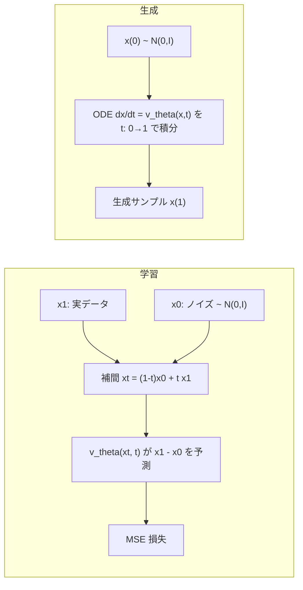
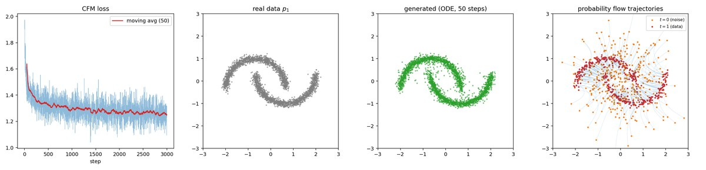
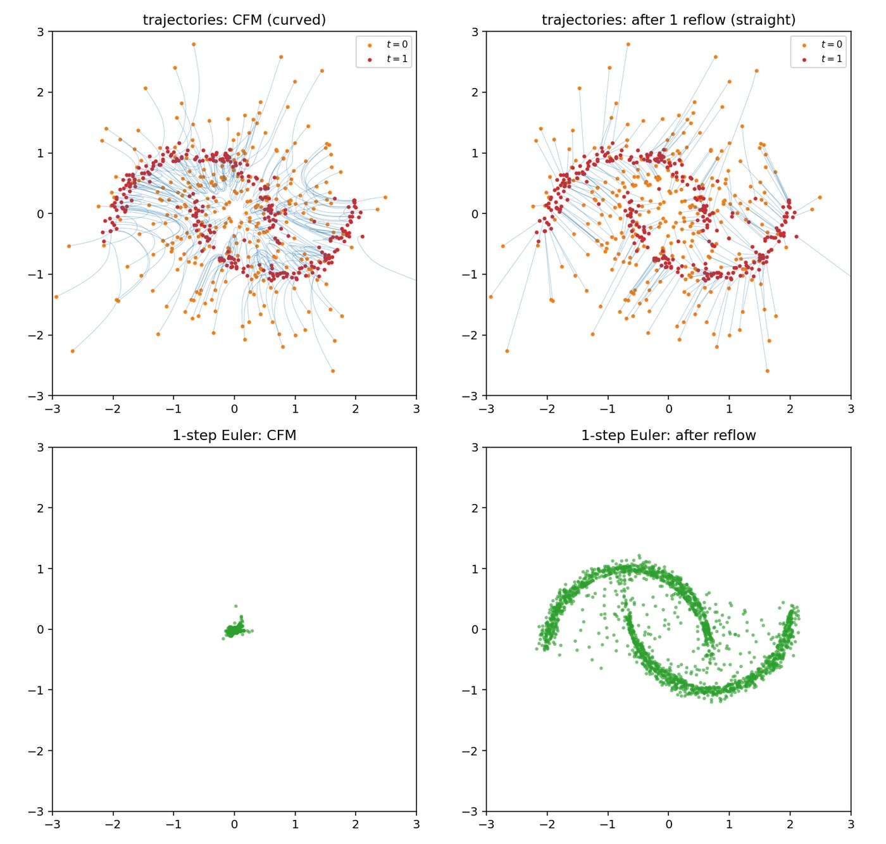
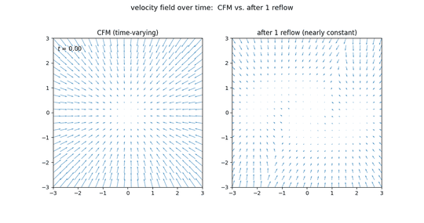
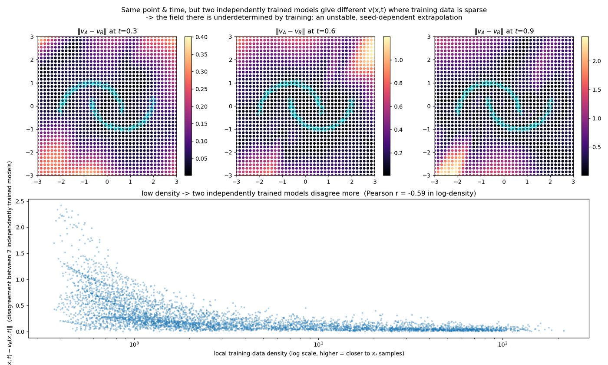

# 2D 基本版 (two moons)

Flow Matching の最小構成。2次元トイデータ (two moons) を使い、CPU でも数十秒〜数分で
一通り動く。アルゴリズムの説明もここにまとめてあり、他のグループ (conditional /
mnist / cifar10) は本質的にこの延長線上にある。

## スクリプト

| ファイル | 内容 |
|---|---|
| `flow_matching_2d.py` | 学習 + ODE サンプリング + 軌跡可視化 |
| `make_gif_2d.py` | 生成過程の GIF 化 |
| `straightness.py` | 軌跡の直線性の実測 + Reflow |
| `compare_fields.py` | CFM と Reflow 後の速度場比較 |
| `trace_points.py` | 固定サンプル点の追跡比較 |
| `field_stability.py` | 速度場の不安定性の実測 |

```bash
cd scripts/2d_basic
python flow_matching_2d.py --steps 5000 && python make_gif_2d.py
```

チェックポイントは `checkpoints/`、図・GIF は `../../out/2d_basic/` に生成される
(いずれも自動作成・`.gitignore` 対象)。`--retrain` で再学習、`--seed` で乱数固定。

## アルゴリズム

ノイズ分布 $p_0=\mathcal N(0,I)$ からデータ分布 $p_1$ へ運ぶ速度場 $v_\theta(x,t)$ を学習する。

**1. 直線パス (OT / Rectified Flow)**

$$x_t = (1-t)\,x_0 + t\,x_1,\qquad x_0\sim\mathcal N(0,I),\; x_1\sim p_{\text{data}},\; t\sim U(0,1)$$

このパスに沿った条件付き速度は時刻によらず定数:

$$u_t(x_t\mid x_0,x_1)=\frac{dx_t}{dt}=x_1-x_0$$

**2. CFM 損失**

$$\mathcal L = \mathbb E_{t,x_0,x_1}\left\|v_\theta(x_t,t)-(x_1-x_0)\right\|^2$$

条件付き速度への回帰だが、その最小化解は周辺確率経路を生成するベクトル場に一致する
(これが Flow Matching の肝)。実装は実質 6 行:

```python
x0 = torch.randn_like(x1)
t  = torch.rand(x1.shape[0], device=x1.device)
xt = (1 - t[:, None]) * x0 + t[:, None] * x1
target = x1 - x0
loss = (model(xt, t) - target).pow(2).mean()
```

**3. サンプリング**

$$\frac{dx}{dt}=v_\theta(x,t),\qquad x(0)\sim\mathcal N(0,I)$$

を $t:0\to1$ で数値積分するだけ。拡散モデルと違い途中でノイズを足さない (決定論的)。
`flow_matching_2d.py` には Euler (1次) と midpoint (2次) を用意した。直線パスの
おかげで軌跡がほぼ直線になり、5〜20 ステップでも形が崩れにくい。





左: ノイズから two moons へ流れるサンプル (尾は軌跡)。右: その時刻の速度場
$v_\theta(x,t)$。$t$ が進むにつれベクトル場が三日月形へ収束していく様子が見える。

## 「Flow Matching は直線を学習する」の正確な意味

よくある誤解: **学習される速度場の軌跡が直線になるわけではない。**

- 直線なのは訓練時の**条件付き**パス $x_t=(1-t)x_0+tx_1$ (ペアを固定したときの経路)
- 学習されるのはその周辺化 $v_\theta(x,t)\approx\mathbb E[x_1-x_0\mid x_t=x]$。$x_0$ と $x_1$ を
  独立にサンプリングしているため経路が大量に交差し、交差点で平均が取られる → **軌跡は曲がる**

`straightness.py` の実測値 (two moons, 2000 サンプル):

| 指標 | CFM | Reflow 1 回後 |
|---|---:|---:|
| 始点-終点の弦からの平均ずれ (弦長比) | 0.606 | 0.006 |
| 同・最大ずれ | 0.978 | 0.0096 |
| 直線性 $S=\mathbb E\int\|v(x_t,t)-(x_1-x_0)\|^2dt$ | 0.843 | 0.0002 |
| 1 ステップ Euler → 実データ最近傍距離 | 0.330 | 0.023 |
| 50 ステップ Euler → 同上 | 0.016 | 0.021 |

**Reflow** は学習済みモデルが作ったペア $(x_0,\mathrm{ODE}(x_0))$ を決定論的カップリングとして
再学習する。このペアでは経路が交差しないので周辺速度がほぼ定数になり、軌跡が直線化して
1 ステップ生成が成立する。




左上: CFM の軌跡 (曲線)。右上: Reflow 後の軌跡 (ほぼ直線)。左下: CFM の 1-step Euler
(原点付近に潰れる)。右下: Reflow 後の 1-step Euler (two moons の形が出る)。

軌跡を実際に少数サンプルで追ったのが `trace_points.py` (`../../out/2d_basic/trace_points.png/.gif`)。

## 速度場の比較 (`compare_fields.py`)

$t=0,0.25,0.5,0.75,1$ の速度場を上段 CFM / 下段 Reflow 後で並べたもの。



- 上段: $t=0$ では原点付近へ吸い込む形だったのが、$t$ が進むにつれ三日月に沿う形へ**作り変わっていく**
- 下段: $t<1$ の間ほぼ同じ形のまま (= 場が時間にほぼ依存しない → 軌跡が直線)

時間変化の数値化には測り方に注意が必要:

| 測り方 | CFM | Reflow 後 |
|---|---:|---:|
| (A) 一様グリッド上の $\|v-\overline{v}^t\|$ | 0.737 | 0.775 |
| (B) 実際に流れが通る点 $x_t$ 上の $\|v(x_t,t)-\overline{v}^t\|$ | 0.783 | **0.009** |

(A) で差が出ないのは、各時刻で確率質量の無い領域 ($p_t$ のサポート外) の値が損失に効かず
学習で決まっていないため。特に $t=1$ ではデータ多様体の外がほぼ全部それに当たり、
GIF の下段右端が乱れているのもこれが理由。直線性は (B) の意味で成立する。

## 速度場の不安定性 (`field_stability.py`)

独立に学習した 2 つのモデル (seed 違い) の速度場がどれだけ食い違うかを、その点における
訓練データ密度と突き合わせた。



**Pearson r = -0.590** (log 密度 vs 2 モデルの不一致)。密度が低いほど 2 モデルの答えが
割れる、はっきりした負の相関。訓練データ $x_t=(1-t)x_0+tx_1$ は「ノイズ点とデータ点を
結ぶ線分」上にしか存在しないため、データから離れた領域は疎な勾配しか受け取らず、
$v_\theta(x,t)$ はほぼ未定義 (= 初期化・学習の乱数任せの不安定な外挿) になる。

## GIF について

`make_gif_2d.py` は ODE の各ステップを 1 フレームとして描画する (既定 80 フレーム、20fps)。

```bash
python make_gif_2d.py --ode-steps 120      # フレーム数を増やす (滑らかになるがファイルも大きくなる)
python make_gif_2d.py --retrain            # チェックポイントを無視して再学習
```

既定設定での GIF は 4〜5 MB 程度。軽くしたい場合は `--ode-steps` を減らすか、
`make_gif_2d(..., n_points=...)` の点数を下げる。

[← リポジトリ全体の README に戻る](../../README.md)
