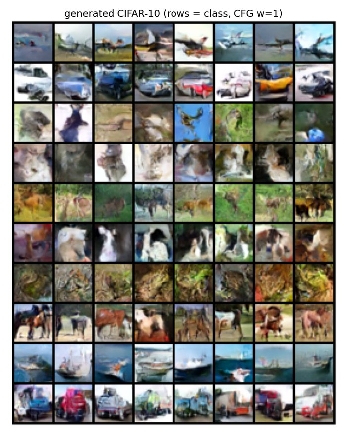
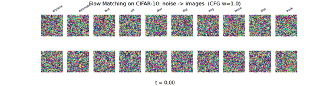
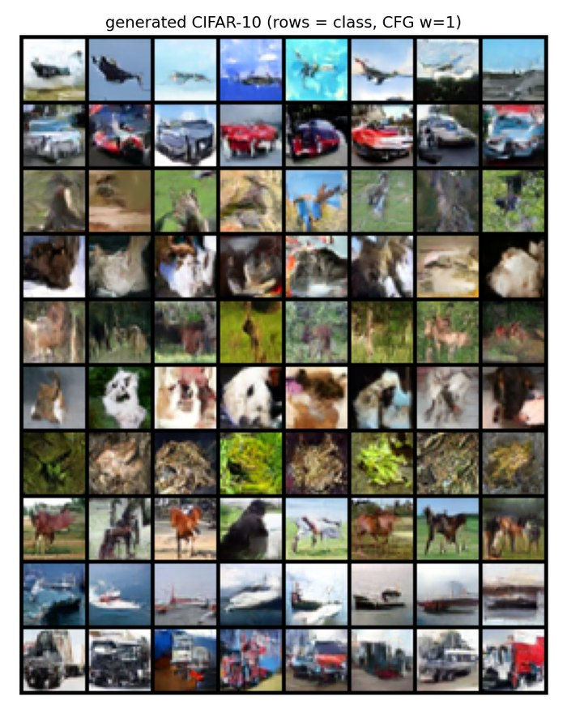
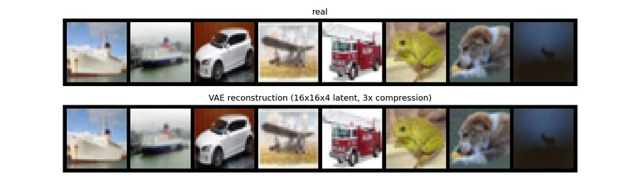
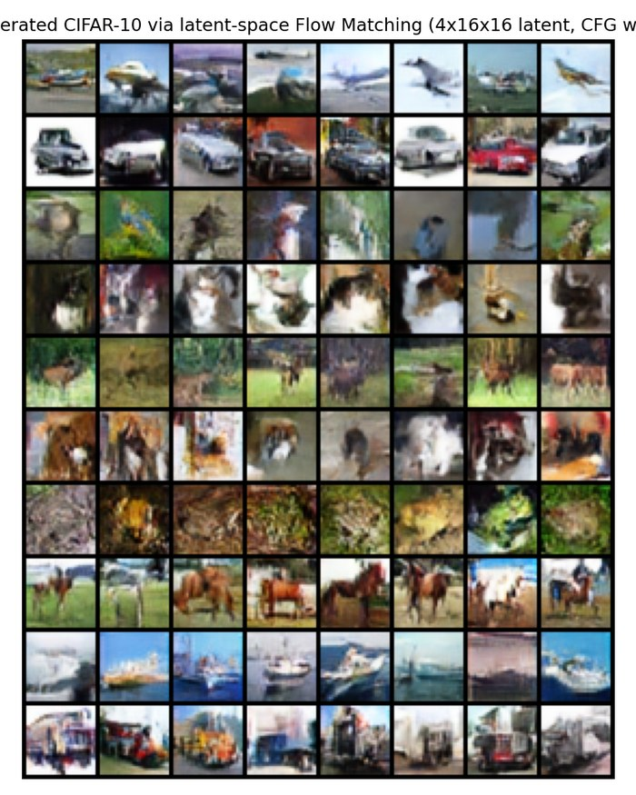

# CIFAR-10 への拡張

[mnist](../mnist/README.md) 版と損失・ODE サンプリングは完全に同一。U-Net も
32x32 → 16x16 → 8x8 → 16x16 → 32x32 と同じ 2 段ダウンサンプル構成がそのまま使え、
変わるのは入出力チャンネル数 (1 → 3) と `base_ch` (64 → 96, 約3.67Mパラメータ) だけ。
CIFAR-10 は 10 クラスの物体 (飛行機・車・鳥・猫・鹿・犬・蛙・馬・船・トラック) で、
クラス条件付け + CFG も MNIST 版と同じ仕組み。ここでは U-Net → DiT → 潜在空間版と
3段階に拡張しながら、GPU 速度の実測もまとめている。

## スクリプト

| ファイル | 内容 |
|---|---|
| `flow_matching_cifar10.py` | 学習 (U-Net) + 生成 + 速度ベンチマーク |
| `make_gif_cifar10.py` | 生成過程の GIF |
| `dit_cifar10.py` | DiT (Vision Transformer) 版 |
| `vae_cifar10.py` | 潜在空間版の前段: 軽量VAE (32x32x3→16x16x4) |
| `flow_matching_cifar10_latent.py` | 潜在空間版 Flow Matching (SD3/Flux と同じ構成) |

```bash
cd scripts/cifar10
python flow_matching_cifar10.py --benchmark-steps 200   # まず速度だけ計測
python flow_matching_cifar10.py --steps 12000            # 本番学習
```

初回実行時に CIFAR-10 を `data/` へ自動ダウンロードする。チェックポイントは
`checkpoints/`、図・GIF は `../../out/cifar10/` に生成される。GPU 推奨(MNIST より
大幅に計算量が増える)。

`--benchmark-steps` を指定すると、その場で計測したステップ時間から 4000 /
8000 / 16000 / 30000 ステップの所要時間を推定して終了する。GTX 1080 Ti
(Pascal, Tensor Core非搭載) での実測は 172ms/step (batch=128) で、
12000 ステップ (約32分) の学習で loss は 1.37 → 0.18 まで低下した。



MNIST ほどクッキリしないが (ぼやけた印象派的な絵)、各行 (クラスごと) の色調・
輪郭は明確にクラスに対応している (飛行機は空を背景に翼状の形、船は水平線と
船体、馬・鹿は四足動物の姿勢など)。370万パラメータ・GPU 32分というごく小さな
計算量でもここまで出るのは、直線的な CFM パスの学習効率の高さの表れ。

`cifar10_steps.png` でステップ数を減らした場合の崩れ方も確認できる。MNIST と
同様、1ステップでもクラスの色調は掴めており、2〜4ステップで輪郭がかなり
はっきりしてくる。

## 品質改善版 (v2): EMA + Attention + データ拡張

`--out-suffix _v2` (既定) で、以下の改善を加えた設定で学習できる:

- **EMA (重みの指数移動平均)**: 生成には学習中の重みそのものではなく、その
  移動平均を使う。拡散/フローモデルで生成品質を上げる定番手法
- **ボトルネック (8x8) への self-attention 追加**: 畳み込みだけでは捉えにくい
  大域的な構造 (物体全体の輪郭) を学習しやすくする
- **水平反転データ拡張**: 実質的にデータ量を2倍に
- **base_ch 96 → 128**: 3.67M → 7.93M パラメータ

実測では、これらを足しても 1 ステップの時間はほぼ変わらなかった (164.5ms/step
vs 172ms/step) — GTX 1080 Ti はこの規模ではまだ計算能力に余裕があったということ。
その分ステップ数を 12,000 → 30,000 に増やし、実測 82 分で学習した。

```bash
python flow_matching_cifar10.py --steps 30000   # v2 (既定)
```


v1 (`cifar10_grid.png`) と比べると、車の窓・ホイール・ボディの輪郭、馬のたてがみと
四肢の構造、船の船体とマストなど、細部がはっきりと見えるようになっている。

生成過程の GIF も v2 チェックポイントで作れる (`make_gif_cifar10.py` に
`--ckpt` / `--base-ch` / `--no-attn` を追加し、v1/v2 どちらのチェックポイントも
読めるようにしてある):

```bash
python make_gif_cifar10.py --ckpt velocity_cifar10_v2.pt --base-ch 128 --out cifar10_denoising_v2.gif
```


### GIF (`make_gif_cifar10.py`)

`make_gif_mnist.py` と全く同じ作り方。10 クラス x 2 サンプルが同時にノイズから
浮かび上がる。

```bash
python make_gif_cifar10.py
```



t=0.4 あたりから大まかな輪郭 (飛行機の機体、鳥の翼など) が見え始め、t=0.7〜1.0
で色や質感が確定していく。MNIST よりも t が進んでからの変化が大きい — カラー
画像は情報量が多く、細部の確定に時間がかかるということが視覚的にわかる。

## DiT (Vision Transformer) 版との比較 (`dit_cifar10.py`)

U-Net を Vision Transformer (DiT, Peebles & Xie 2022 のミニ版) に置き換えた版。
損失・ODE サンプリング・EMA・データ拡張などのインフラは `flow_matching_cifar10.py`
からそのまま再利用し、ネットワークだけが違う。

- 32x32x3 画像を 4x4 パッチ (8x8=64トークン) に分割し線形射影
- 時刻+クラス条件は adaLN-Zero (各 Transformer ブロックでシフト・スケール・
  ゲートを変調) で注入。U-Net 版の「特徴マップに加算」より表現力が高い
- dim=256, depth=6, 約7.4Mパラメータ (U-Net v2 の7.93Mと同規模で比較用に設計)

**速度の実測**: GTX 1080 Ti でトークン数が少ない (64個) ぶん、同程度の
パラメータ数でも U-Net より高速だった。

| | U-Net v2 | DiT |
|---|---:|---:|
| パラメータ数 | 7.93M | 7.41M |
| 1ステップ (batch=128) | 156ms | 77.5ms (約2倍速) |
| GPU使用率 (batch=128) | 92〜96% | 92〜96% |
| GPU使用率 (batch=32) | — | 71〜73% |

バッチサイズを 128→64→32→16 と下げていくと GPU 使用率は素直に下がるが、
1ステップの時間は batch=16 あたりで下げ止まる (Python ループ側のオーバーヘッドが
支配的になるため)。今回は「画面描画用に GPU 使用率を少し空けたい」という
実用上の理由で batch=32・ステップ数はその分増やして (120,000 ステップ、
U-Net v2 と同じ384万サンプル相当) 学習した。実測 GPU 使用率は 61〜73%、
所要時間は約64分。

```bash
python dit_cifar10.py --benchmark-steps 200 --batch-size <N>   # 速度確認
python dit_cifar10.py --steps 120000 --batch-size 32           # 本番学習
```



U-Net v2 (`cifar10_grid_v2.png`) と見比べると、車の窓・ボディの反射や馬の
輪郭などは同等かそれ以上に鮮明で、この小規模・短時間の条件でも DiT が
U-Net に見劣りしないことが確認できた。事前の予想 (「畳み込みの帰納バイアスが
無い分、小規模条件では不利では」) は外れ、トークン数が少ない CIFAR-10 の
ような低解像度では Attention 主体のアーキテクチャでも十分学習できるようだ。

## 潜在空間版 (VAE + Flow Matching): SD3/Flux と同じ構成

「この解像度でも潜在空間に落とせるか」を実際に試した記録。SD3/Fluxは画像をVAEで
圧縮した潜在空間の中でFlow Matchingを行うが、CIFAR-10 (32x32) は元々小さいため、
標準的な8倍圧縮では 4x4 まで潰れて情報が失われすぎる。そこで**空間2倍・
チャンネル3→4の軽い圧縮** (32x32x3=3072次元 → 16x16x4=1024次元、約3倍圧縮)
に留めた自前VAEを用意した。

### 1. VAE (`vae_cifar10.py`)

GroupNorm+SiLUの残差ブロックによる軽量エンコーダ/デコーダ (約0.89Mパラメータ)。
損失は再構成誤差(MSE) + KL項 (weight `--beta` は既定 1e-5 とごく小さく、
SD系VAEと同様「正規分布への近さ」より「再構成品質」を優先する設定)。

```bash
python vae_cifar10.py --steps 8000
```

実測 59.4ms/step、8000ステップ約8分で recon loss 0.0011 まで収束。



3倍圧縮でもほぼ見分けがつかないレベルで再構成できている。

### 2. 潜在空間での Flow Matching (`flow_matching_cifar10_latent.py`)

学習済みVAEで全データを一度だけ潜在表現にエンコードしてキャッシュし (毎ステップ
VAEを通すと遅いため)、その 16x16x4 の潜在表現の上で `flow_matching_cifar10.py`
と全く同じ CFM 損失・EMA・データ拡張のコードを再利用する。速度場のU-Netも
チャンネル数 (3→4) を変えるだけでそのまま使い回せた (ハードコードされた
解像度が無いため 16→8→4 のダウンサンプルも無改造で動く)。生成時は潜在空間で
ODEを解いたあと、VAEデコーダでピクセルに戻す。

```bash
python flow_matching_cifar10_latent.py --steps 30000
```

実測 48.5ms/step (U-Net v2 のピクセル版 156ms/step の約3倍速)。30000ステップ
約24分で学習。



**事前の予想 (VAEのボケが品質上限になり不利では) は外れ**、車の窓・ホイール・
ボディパネル、馬の鞍や乗り手まで見えるなど、これまでの4パターン
(v1 / v2 / DiT / 潜在空間版) の中でも最も鮮明な結果になった。考えられる理由:

- VAEの再構成自体が高品質 (3倍程度の軽い圧縮なら情報損失がほぼ無い)
- 速度場が学習するのは 1024次元の潜在空間で、3072次元のピクセル空間より
  「予測すべきものがシンプル」になり、同じ計算量・ステップ数でも最適化が
  進みやすい可能性がある
- 計算コストが下がった分 (3倍速)、同じ時間予算ならより多くのステップを
  回せる

### まとめ表

| | v1 (baseline) | v2 (EMA+Attn+拡張) | DiT | 潜在空間版 |
|---|---:|---:|---:|---:|
| 空間 | ピクセル (32x32x3) | ピクセル (32x32x3) | ピクセル (32x32x3) | **潜在 (16x16x4)** |
| パラメータ数 | 3.67M | 7.93M | 7.41M | 7.94M (+VAE 0.89M) |
| 1ステップ (batch=128) | 172ms | 156ms | 77.5ms | **48.5ms** |
| 学習ステップ数 | 12,000 | 30,000 | 120,000 (batch=32) | 30,000 |
| 学習時間 | 32分 | 82分 | 64分 | 24分 (+VAE 8分) |
| 主観品質 | 低 (ぼやけた印象派風) | 良好 | 良好〜やや良好 | **最良** |

## 学習速度の実測: Pascal (Tensor Core非搭載) GPUでの高速化テクニック

「学習を速くしたい」と思ったときにまず試したくなる定番のテクニックを、
このGTX 1080 Ti (Pascal, compute capability 6.1) で実測した結果。

| 手法 | 効果 |
|---|---:|
| `torch.compile` | **使用不可** (Triton が compute capability 7.0 以上を要求、Pascal は 6.1) |
| `torch.backends.cudnn.benchmark = True` | 誤差範囲 (±2%) |
| `channels_last` メモリフォーマット | **-42% (悪化)** |
| fp16 混合精度 (AMP) | **-12% (悪化)** |
| EMA更新を毎ステップ→5ステップに1回に間引く | +2%程度 |
| バッチサイズ 128→256 | **+8.7% (1サンプルあたり)** |
| バッチサイズ 128→512 | +10.5% (頭打ち) |

**結論**: AMP・channels_last・torch.compile は全て Volta 以降の Tensor Core を
前提にした最適化であり、Pascal ではキャスト/変換のオーバーヘッドだけが乗って
むしろ悪化する。1サンプルあたりのスループットで見れば効果があったのはバッチ
サイズを上げることだけだった。ただし下の節の通り、これは**壁時計時間で見た
学習効率とは別物**だったので注意。

「Pascal世代のGPUで学習を高速化したい」場合、モダンなGPU (Ampere以降) 向けの
チュートリアルに書いてある高速化テクニックをそのまま試すのは効果が薄いか
逆効果になりやすい、というのがこの実験からの実用的な教訓。

### 「1サンプルあたりの速度」と「壁時計時間あたりのloss低下」は別物

上の表でバッチサイズ128→256が「+8.7% (1サンプルあたり)」と出たため、
一度は既定バッチサイズを256に変更した。しかし同じ壁時計時間 (3分ずつ) で
学習率を揃えて (linear scaling rule で256側は学習率も2倍にして) 実際に
loss の下がり方を比較したところ、**むしろ128の方が終始 loss が低かった**:

| 設定 | 3分間の更新回数 | 到達loss (直近100ステップ平均) |
|---|---:|---:|
| batch=128, lr=2e-4 (既定) | 3,753 | **0.4424** |
| batch=256, lr=2e-4 (素朴に据え置き) | 2,086 | 0.4543 |
| batch=256, lr=4e-4 (learning rate も比例して倍増) | 2,141 | 0.4447 |

理由: 1サンプルあたりの処理は256の方が効率的でも、同じ壁時計時間で見た
**勾配更新の回数**は128の方が圧倒的に多い (3,753 vs 2,100程度)。この学習量
(数千ステップ規模) では、更新回数の多さが1回あたりの効率の良さを上回った。
教訓として、**「スループット (samples/sec) を上げる変更」が必ずしも
「同じ時間でどれだけlossが下がるか」を改善するとは限らない**ため、変更後は
実際の loss 低下を壁時計時間で比較して検証する必要がある。既定バッチサイズは
128 のまま (`flow_matching_cifar10_latent.py` のデフォルト)。

### 同じ検証をモデルサイズ (base_ch) でも実施

「ブロック (base_ch) を大きくすれば品質が上がるのでは」という仮説も、
バッチサイズと同じ方法 (batch=128, lr=2e-4 固定、壁時計3分ずつ) で検証した:

| 設定 | パラメータ数 | 3分間のステップ数 | 到達loss (直近100ステップ平均) |
|---|---:|---:|---:|
| base_ch=128 (既定) | 7.94M | 2,741 | **0.4521** |
| base_ch=192 | 17.69M | 896 | 0.4798 |
| base_ch=256 | 31.30M | 458 | 0.5086 |

結果はバッチサイズのときと同じパターン。base_ch を上げるとブロックあたりの
計算量がチャンネル数のほぼ2乗で増え (128→256 でパラメータ数は約4倍、
1ステップの時間は3.35倍)、同じ3分間でこなせる更新回数が 2,741 → 896 → 458 と
激減する。表現力は上がっても更新回数の減少がそれを上回り、**この学習時間
スケール (数千ステップ) では base_ch を上げるほどむしろ loss が悪化した**。
「モデルを大きくすれば品質が上がる」も、学習時間を十分に確保できて初めて
成り立つ話であり、短時間の比較では逆効果になり得る、という教訓が
バッチサイズの場合と共通して得られた。

### 時刻 t のサンプリング分布を切り替え可能にした (`--t-dist`)

`cfm_loss` / `train` (U-Net・DiT・潜在空間版で共通) に `--t-dist {uniform,logit_normal}`
オプションを追加した。`logit_normal` は SD3 (Esser et al. 2024) と同じスケジュールで、
$u\sim\mathcal N(\text{mean},\text{std})$ を sigmoid で $(0,1)$ に写し、$t=0.5$ 付近
(ノイズと実データの中間、最も情報量の多い領域) を重点的にサンプリングする。
実測では t=0.4〜0.6 に入る割合が一様分布の20.5%からlogit_normalで31.3%に増加し、
速度への影響はほぼゼロ (追加コストがないので試す価値が高い)。壁時計時間での
loss 比較はまだ実施していない。

```bash
python flow_matching_cifar10_latent.py --t-dist logit_normal
```

## 今後の高速化アイデア

Reflow 以外にも、Flow Matching / 拡散モデルの生成を高速化する手段はいくつかある
(このリポジトリでは未実装、調査メモとして記載):

| カテゴリ | 手法 | 概要 |
|---|---|---|
| サンプラー側 (再学習不要) | 高次・適応刻み幅 ODE ソルバー (DPM-Solver++, DEIS 等) | 拡散/フローODEの半線形構造を利用し、再学習なしで10〜20ステップまで削減 |
| サンプラー側 | guidance 蒸留 | CFG の条件あり・条件なし 2 回のフォワードを 1 回に蒸留し、計算量を半分に |
| モデル再学習 (蒸留) | Consistency Models / Consistency Distillation | ODE軌跡上のどの点からもワンステップで終点に飛べるよう自己無矛盾性を学習 |
| モデル再学習 | Progressive Distillation | 生徒モデルが教師の2ステップ分を1ステップで模倣、を繰り返し半減 |
| モデル再学習 | Adversarial Diffusion Distillation (ADD, SDXL-Turbo) / DMD, DMD2 | GAN損失・分布マッチング損失で1〜4ステップ生成 |
| モデル再学習 | InstaFlow | Reflow (直線化) の先にさらに蒸留を重ね、1ステップ生成まで踏み込む |
| 学習側の工夫 | 時刻 $t$ のサンプリング分布 (logit-normal 等) | 同じステップ数でも生成品質が向上 (SD3 等で採用、上の `--t-dist` で試験導入済み) |
| 学習側の工夫 | ミニバッチ最適輸送カップリング (Tong et al.) | $x_0,x_1$ をバッチ内で最適輸送させてからペアにし、最初から軌跡を素直にする |
| システム側 | 潜在空間での実行 | 本リポジトリで実装済み (上記参照)、ステップ数でなく1ステップあたりのコストを削減 |
| システム側 | 特徴キャッシュ (DeepCache 等) | 隣接タイムステップでのU-Net浅層特徴の再利用 |
| システム側 | 並列サンプリング (ParaDiGMS 等) | 複数タイムステップを固定点反復で同時に解き、GPU並列でレイテンシ削減 |

[← リポジトリ全体の README に戻る](../../README.md)
