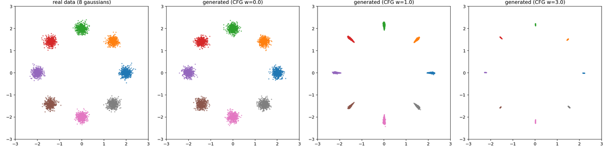
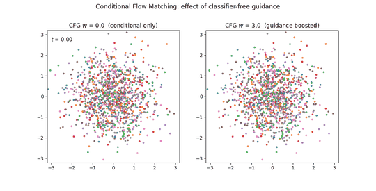

# 条件付き生成と CFG (8 gaussians)

クラス条件付き生成と Classifier-Free Guidance (CFG) の最小構成。アルゴリズムの土台は
[2d_basic](../2d_basic/README.md) と共通、変わるのはラベル条件付けと CFG の推論時合成だけ。

## スクリプト

| ファイル | 内容 |
|---|---|
| `flow_matching_conditional.py` | 学習 + クラス条件生成 |
| `make_gif_conditional.py` | CFG 比較の GIF |

```bash
cd scripts/conditional
python flow_matching_conditional.py --steps 4000 && python make_gif_conditional.py
```

チェックポイントは `checkpoints/`、図・GIF は `../../out/conditional/` に生成される。

## CFG の仕組み

速度場を $v_\theta(x,t,y)$ とし、学習時に確率 `--p-uncond` (既定 0.1) でラベルを null
トークンへ置き換える。生成時は

$$v_{\text{cfg}} = v_\theta(x,t,\varnothing) + (1+w)\bigl(v_\theta(x,t,y)-v_\theta(x,t,\varnothing)\bigr)$$

拡散モデルの CFG と同じ形。



左から: 実データ、$w=0$ (条件付けなし相当)、$w=1$、$w=3$。$w$ を上げるほど各モードが
縮み、多様性と条件忠実度のトレードオフ (over-saturation) がそのまま現れている。



**同じ初期ノイズ**から $w=0$ と $w=3$ で並走させた比較。$w=3$ 側は早い段階でモードへ
分離し、最後は分布が潰れる。

## なぜ差分 $v_{\text{cond}}-v_{\text{uncond}}$ が効くのか (ベイズ的な導出)

Flow Matching の $v_\theta(x,t,y)$ は拡散モデルのスコア $\nabla_x\log p_t(x\mid y)$ と
同じ役割を果たす。ベイズの定理

$$\log p_t(y\mid x)=\log p_t(x\mid y)-\log p_t(x)+\text{const}(y)$$

の両辺を $x$ で微分すると

$$\nabla_x\log p_t(y\mid x)=\nabla_x\log p_t(x\mid y)-\nabla_x\log p_t(x)$$

つまり **$v_{\text{cond}}-v_{\text{uncond}}$ は、モデルが暗黙に持つ「分類器」
$p_t(y\mid x)$ の対数尤度の勾配そのもの**である。分類器を別途学習しなくても、
条件付き・条件なしの 2 通りを学習するだけで分類器の勾配が手に入る、というのが
Classifier-**Free** の意味。

外挿係数 $(1+w)$ をかけてこの方向に余分に進むと、実質的に次のように強調された
分布からサンプリングしていることになる:

$$p_w(x\mid y)\;\propto\;p(x\mid y)\cdot p(y\mid x)^w$$

$p(y\mid x)^w$ の部分が「モデル自身の暗黙の分類器がクラス $y$ だと確信している度合い」
を $w$ 乗で強調する項。$w$ を上げるほど分布が先鋭化 (mode-seeking) し、典型的な
サンプルに集中する (= クラスらしさは増すが多様性は落ちる) — 上の GIF で見えている挙動そのもの。

なお CFG は 1 ステップごとに条件あり・条件なしの**2 回のフォワード計算**が必要
(計算コストが単純に 2 倍になる)。この計算コストを 1 回に減らす「guidance 蒸留」など、
生成の高速化については [cifar10/README.md](../cifar10/README.md#今後の高速化アイデア)
を参照。

[← リポジトリ全体の README に戻る](../../README.md)
