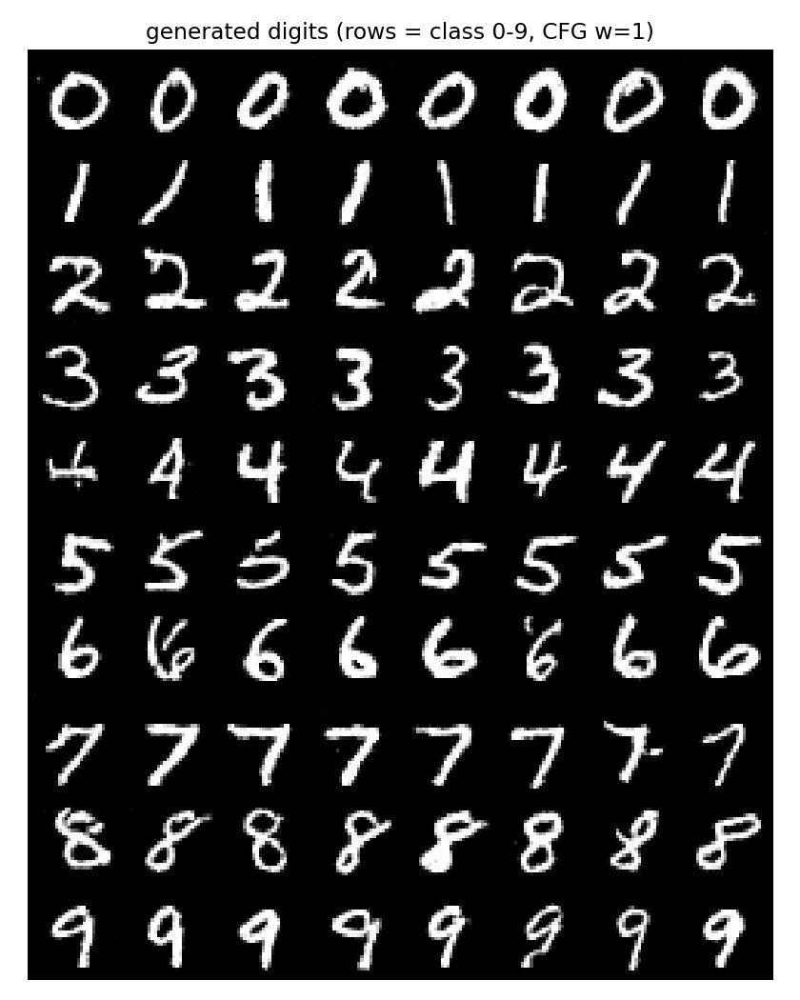
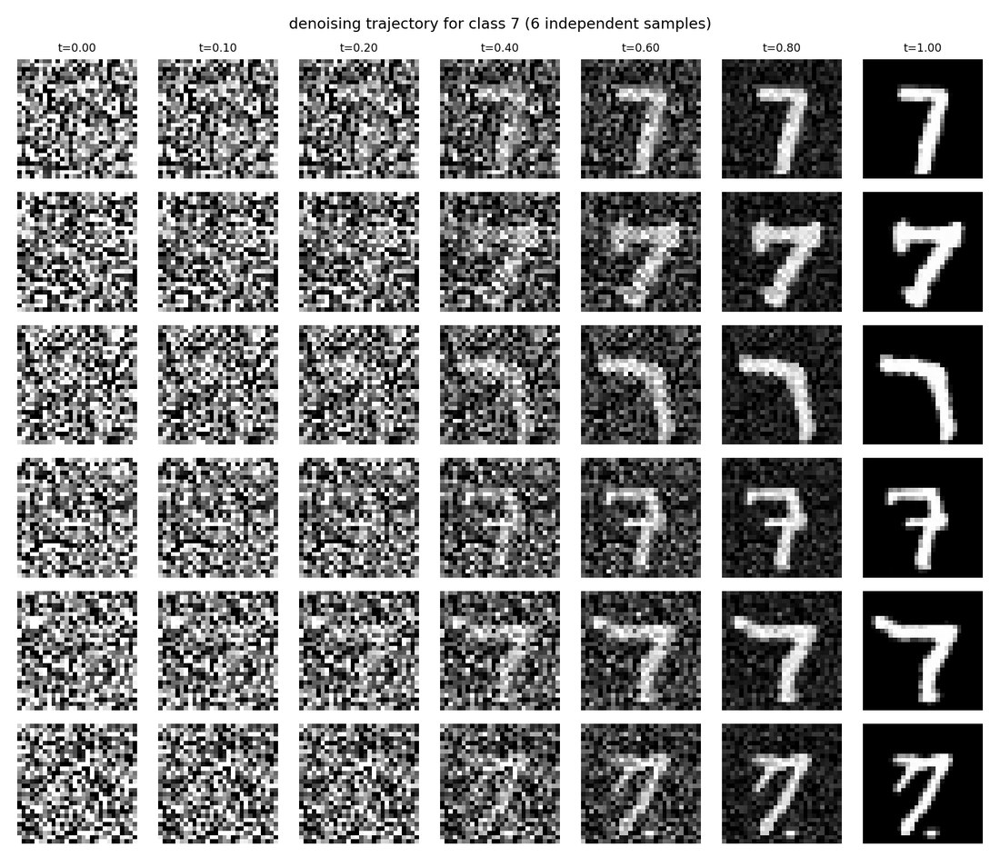
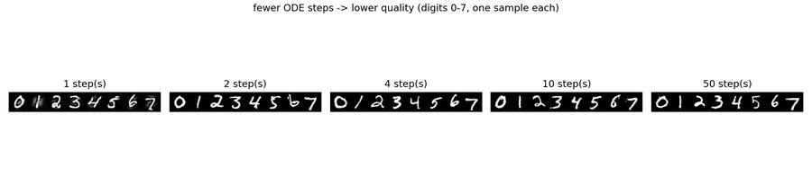
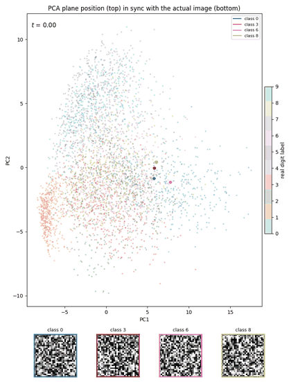
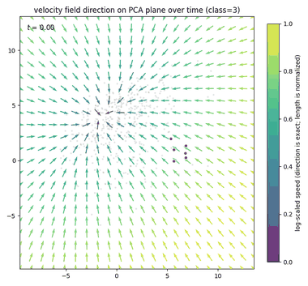
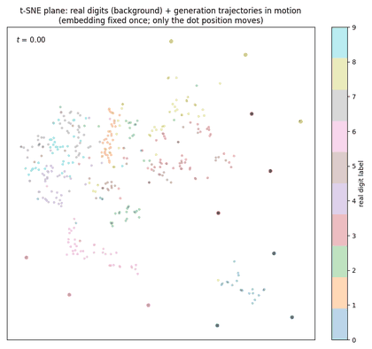
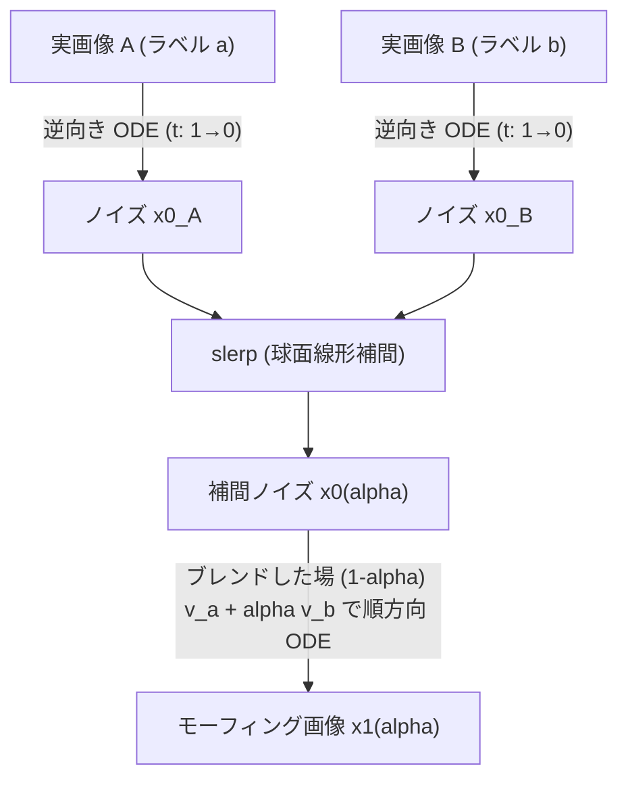
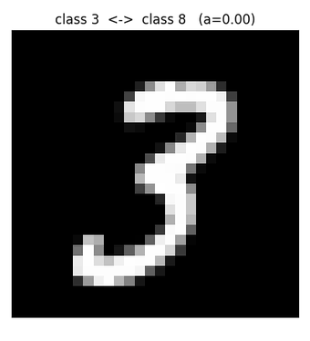

# MNIST への拡張

[2d_basic](../2d_basic/README.md) と **損失・ODE サンプリングは完全に同一**。変わるのは
速度場 $v_\theta$ を MLP から画像用の小さな U-Net (GroupNorm + 残差ブロック,
28→14→7→14→28 の解像度、約1.7Mパラメータ) に差し替え、入力が 1x28x28 の画像に
なる点だけ。クラスラベル (0-9) 条件付け + CFG も [conditional](../conditional/README.md)
と同じ仕組みで実装している。

## スクリプト

| ファイル | 内容 |
|---|---|
| `flow_matching_mnist.py` | 学習 (U-Net) + 生成 |
| `make_gif_mnist.py` | 生成過程の GIF |
| `field_mnist.py` | ピクセル単位の速度場可視化 |
| `feature_space_mnist.py` | PCA / t-SNE 平面への写像 |
| `reflow_mnist.py` | Reflow (決定論的ペアで再学習し軌跡を直線化) |
| `morph_mnist.py` | ODE 逆変換によるノイズ空間モーフィング |

```bash
cd scripts/mnist
python flow_matching_mnist.py --steps 8000
```

初回実行時に MNIST を `data/` へ自動ダウンロードする。チェックポイントは
`checkpoints/`、図・GIF は `../../out/mnist/` に生成される。RTX 環境で 8000
ステップ・約 2 分半、loss は 2.0 → 0.16 まで低下する。

`--retrain` で再学習、`--base-ch` でネットワーク幅、`--p-uncond` でラベルドロップ率を
変更できる。



0〜9 を各8枚、CFG w=1 で生成。実測で崩れなく読める数字が生成できた。



クラス7を固定し、ノイズ (t=0) から数字が浮かび上がる過程を6サンプル分並べたもの。
t=0.4 あたりから輪郭が見え始め、t=0.6〜0.8 でほぼ確定する。



Euler 1/2/4/10/50 ステップでの生成品質比較。**1ステップでも読める数字が出る** —
2D トイデータと同様、直線的な CFM パスのおかげで極端に少ないステップ数でも崩壊しにくい。

## GIF (`make_gif_mnist.py`)

`make_gif_2d.py` (2D 版) と全く同じ作り方: ODE を `steps` 分割し midpoint 法で積分、
各時刻の画像を全部保持しておいて `FuncAnimation` の 1 フレーム = 1 ステップに
割り当て、`PillowWriter` で `.gif` に書き出すだけ。2D 版との違いは描画対象が
散布図 (`scatter`) ではなく画像 (`imshow`) という点のみ。

```bash
python make_gif_mnist.py                        # 0-9 x 3 サンプルが同時に浮かび上がる
python make_gif_mnist.py --samples-per-class 1   # 軽量版 (10 桁のみ)
python make_gif_mnist.py --dpi 80                # ファイルサイズを下げる (既定 100)
```

`mnist_denoising.gif` は t=0.4〜0.7 あたりで一気に数字の形が出てくる。GIF 化の
一般的な型は次の 3 ステップ:

1. ODE の各ステップの状態を `torch.stack(...)` で全部メモリに保持する
2. 描画要素 (imshow / scatter / quiver など) を 1 回だけ作り、
   `update(i)` の中で `set_data` / `set_offsets` / `set_UVC` を呼んで中身だけ差し替える
   (matplotlib オブジェクトを毎フレーム作り直すと遅い)
3. `FuncAnimation(fig, update, frames=...)` → `anim.save(path, writer=PillowWriter(fps=...))`

最後に同じフレームを `HOLD_FRAMES` 回繰り返すと、ループ再生したときに
完成形で一瞬止まって見やすくなる。

## 速度場の可視化 (`field_mnist.py`)

2D トイデータでは空間が $(x,y)$ の 2 次元だったので、各点に矢印 $v_\theta(x,t)\in\mathbb R^2$
を描けた (`compare_fields.py`)。MNIST は空間が 784 次元 (28x28 ピクセル) なので、
1 点における速度ベクトルも 784 次元になり矢印には描けない。

ただし $v_\theta(x_t,t)$ は $x_t$ と全く同じ形 (1x28x28) を持つ。つまり
「各ピクセルを今後どちらにどれだけ動かすか」をそのまま画像として
(発散カラーマップ `RdBu_r` で正負を色分けして) 表示できる。これが
高次元版の「速度場」の可視化になる。

```bash
python field_mnist.py --label 3
```

`field_mnist.png` / `.gif` は上段に $x_t$、下段に $v_\theta(x_t,t)$ を並べる。
見た目には $t$ が変わっても速度場の模様があまり変わらないように見えるが、
実測すると $\|v_0 - v_{49}\|$ は全体ノルムの 6 割程度あり、しっかり時間変化している
([2d_basic](../2d_basic/README.md#速度場の不安定性-field_stabilitypy) の議論と同じで、
ノイズ由来の高周波成分が同じ色スケールで支配的に見えるだけ)。大まかな構造は早い段階で
ほぼ決まり、細部だけが後から詰まっていく — 拡散モデルの典型的な挙動と同じ。

## 低次元への写像で見る: PCA vs t-SNE (`feature_space_mnist.py`)

`field_mnist.py` はピクセル単位の速度を画像として見る方法だったが、
「784次元空間の中を軌跡や速度場がどう動くか」を低次元に写像して俯瞰する
こともできる。ただし **PCA と t-SNE では扱いが本質的に違う**:

- **PCA は線形写像** $y=P(x-\bar x)$。線形なので $\frac{dy}{dt}=P\frac{dx}{dt}=Pv_\theta(x,t)$
  が厳密に成り立つ。つまり速度ベクトルもそのまま射影でき、2D トイデータのときと
  **同じ streamplot が「ちゃんとした矢印場」として描ける**。さらに $P$ の疑似逆
  写像でグリッド点を画像へ持ち上げてモデルを評価すれば、平面全体の場を可視化できる
- **t-SNE は非線形**なのでこの関係が成り立たず、速度ベクトルを射影する数学的
  根拠がない。できるのは「実際の軌跡上の点」を埋め込んで位置を追うことだけ
  (矢印場は作れない)

```bash
python feature_space_mnist.py             # PCA 2枚 + t-SNE 1枚 (静止画)
python feature_space_mnist.py --no-tsne   # t-SNE は重いので省略したい場合
python feature_space_mnist.py --gif       # GIF も作る (静止画に加えて)
```

### PCA: 軌跡と速度場



サンプルを 4 個 (クラス 0, 3, 6, 8 を 1 個ずつ) に絞り、PCA 平面上の位置と、その時点の
実際の画像を同期させたもの (静止画版: `pca_trajectories_with_images_mnist.jpg`)。
上段の軌跡と下段の画像が完全に同期しており、「PCA平面上のこの位置にいるとき、実際には
こういう画像だった」を直接対応づけて見られる。



$t=0.2,0.5,0.8,0.99$ での速度場を PCA 平面上に streamplot として描画 (class=3、
静止画版: `pca_field_mnist.jpg`)。明確な吸引構造 (sink) が見え、実際のサンプルもその
流れに沿って動いている。データが疎な領域 (特に $t\to1$ 付近) は矢印の**大きさ**が
暴れやすい ([2d_basic](../2d_basic/README.md#速度場の不安定性-field_stabilitypy) と同じ
現象) ので、GIF 版では向きだけ揃えて長さを一定にし、大きさは色 (log スケール) で
表している。

### t-SNE: 軌跡とジグザグ現象



実データ + 複数クラスの生成軌跡を t-SNE で同時埋め込み (静止画版:
`tsne_trajectories_mnist.png`)。各軌跡が正しいクラスのクラスタへ向かって伸びていく
様子が PCA よりはっきり分離して見える (t-SNE はクラス分離を強調するため) 一方、
点が細かく行ったり来たりする「ジグザグ」も見える。これは ODE の 1 ステップあたりの
移動量が小さく (隣接する $x_t$ はピクセル空間でほぼ重複点)、t-SNE が「どの点がどの点の
近傍か」という確率だけを再現する最適化なので、ほぼ同じ距離にある点の細かい並び順は
最適化のノイズ (反発力・勾配降下) 任せになるためである。実測で確認した:

| 指標 | ピクセル空間 (784次元) | PCA 空間 | t-SNE 空間 |
|---|---:|---:|---:|
| 隣接ステップの移動方向コサイン類似度 (平均) | 1.000 | 1.000 | **-0.180** |
| 同・最小値 | 0.996 | 0.996 | -0.987 |
| 移動方向が逆転する割合 | 0% | 0% | **63%** |
| 1 ステップ移動量の変動係数 | 0.013 | 0.064 | 0.388 |

PCA は線形写像なので他の点と無関係に $x$ ごとに固定の行列を掛けるだけ (ノイズが
入り込む余地がない)。t-SNE は全点を同時に見て反復最適化するアルゴリズムなので、
ほぼ重複した点の並び順がノイズ任せになる。**「マクロには意味のある動き、ミクロには
ほぼランダムな順序」**というのが正確な理解であり、PCA の方が Flow Matching の
挙動 (速度場・軌跡の直線性など) を見るには忠実で、t-SNE は「生成結果が正しいクラスの
塊に着地しているか」という分類的サニティチェック専用と割り切るべき。

PCA は上位2成分しか使わないため、生成された数字が本当に「合っている」かの
判定には情報量が足りず、クラス同士がかなり重なる。t-SNE は非線形ゆえに
クラスをきれいに分離するが、速度場という物理的な意味は失われる — 目的に応じて
使い分けるとよい。

## Reflow で軌跡を直線化する (`reflow_mnist.py`)

[2d_basic/straightness.py](../2d_basic/README.md#直線を学習するの正確な意味)
と全く同じ考え方を MNIST に適用する。

1. 学習済みモデルで決定論的ペア $(x_0, y, x_1{=}\mathrm{ODE}(x_0\mid y))$ を大量に生成
2. その直線パス $x_t=(1-t)x_0+tx_1$ で新しい速度場を再学習 (ラベルドロップアウトも
   維持するので CFG は再学習後も使える)
3. `checkpoints/velocity_mnist_reflow1.pt` に保存

```bash
python reflow_mnist.py --n-pairs 8000 --train-steps 6000
```

8000 ペア生成 + 6000 ステップ学習 (loss 1.77 → 0.01) で GPU 上数分。実測
(300 サンプル、ODE 60 ステップ):

| 指標 | base (CFM) | reflow 後 |
|---|---:|---:|
| 弦からの平均ずれ (弦長比) | 0.0448 | **0.0244** |
| 弦からの最大ずれ (弦長比) | 0.0659 | **0.0378** |

`pca_trajectories_with_images_mnist_reflow.png` / `.gif` は、この reflow モデルで
上の「PCA + 実画像」図を描き直したもの。base 版と見比べると、特に class 3 と class 8
の軌跡が PCA 平面上でほぼ一直線になっているのがわかる。下段の画像 (生成品質) 自体は
base 版とほぼ同じで、**同じ生成品質のまま経路だけが直線に近づいた**ことが確認できる。

```bash
python -c "
import torch
from pathlib import Path
from flow_matching_mnist import UNetVelocity, load_mnist_tensor
from feature_space_mnist import fit_pca, make_pca_trajectories_with_images, make_pca_trajectories_with_images_gif

device = torch.device('cuda' if torch.cuda.is_available() else 'cpu')
ckpt_dir = Path('checkpoints')  # scripts/mnist から実行する想定
reflow_model = UNetVelocity().to(device)
reflow_model.load_state_dict(torch.load(ckpt_dir / 'velocity_mnist_reflow1.pt', map_location=device))
reflow_model.eval()

images, labels = load_mnist_tensor(device)
idx = torch.randperm(images.shape[0])[:8000]
mean, comps = fit_pca(images[idx], n_components=2)
real_idx = torch.randperm(images.shape[0])[:4000]
real_sub, real_sub_labels = images[real_idx].cpu(), labels[real_idx].cpu()

out_dir = Path('../../out/mnist')
make_pca_trajectories_with_images(reflow_model, real_sub, real_sub_labels, mean.cpu(), comps.cpu(), device,
                                   out_dir / 'pca_trajectories_with_images_mnist_reflow.png')
make_pca_trajectories_with_images_gif(reflow_model, real_sub, real_sub_labels, mean.cpu(), comps.cpu(), device,
                                       out_dir / 'pca_trajectories_with_images_mnist_reflow.gif')
"
```

## ノイズ空間でのモーフィング (`morph_mnist.py`)

Flow Matching の ODE は拡散モデルの SDE と違って決定論的かつ可逆。実データの画像から
時間を逆向きに ODE を解けば、対応するノイズを (近似的に) 復元できる (DDIM inversion
と同じ発想)。この性質を使うと、2つの実数字をノイズ空間で補間しながらモーフィングできる。



手順:

1. 数字A・数字Bの実画像を、それぞれ自分のクラスラベルで逆向きに ODE を解いてノイズ
   $x_0^A, x_0^B$ を求める (inversion)
2. 2つのノイズを球面線形補間 (slerp) する。高次元ガウスノイズは単純な線形補間だと
   中間点だけノルムが縮んで崩れた画像になりやすいため slerp を使う
3. 補間したノイズを、2クラスの条件付き速度場を同じ比率でブレンドした場で順方向に解く
   (alpha=0 で数字Aの再構成、alpha=1 で数字Bの再構成、間はノイズ・クラス条件の両方が
   滑らかに混ざる)

```bash
python morph_mnist.py --steps 60
python morph_mnist.py --gif-pair 4 9   # GIF で使うペアを変える
```



3→8, 4→9, 1→7 の3ペアを alpha=0〜1 で連続モーフィングさせたもの (静止画版:
`morph_mnist.png`)。"3"の下のループがそのまま"8"の下半分に繋がる、"1"の斜線が"7"の
斜線として引き継がれるなど、書体のスタイルを保ったまま滑らかに変形する。

**inversion の精度確認**: alpha=0 (=元のノイズをそのまま再デコードしたもの) と元の
実画像を比較すると、60ステップで RMSE 0.0007 程度とほぼ完全に一致する。これは
ODEが決定論的で誤差要因が数値積分の離散化誤差だけであることの裏付けでもある。

[← リポジトリ全体の README に戻る](../../README.md)
